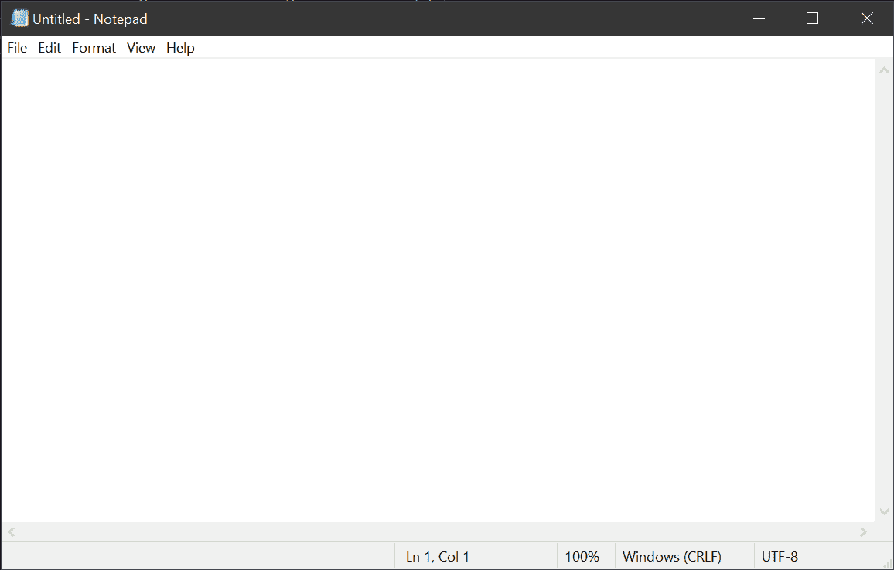
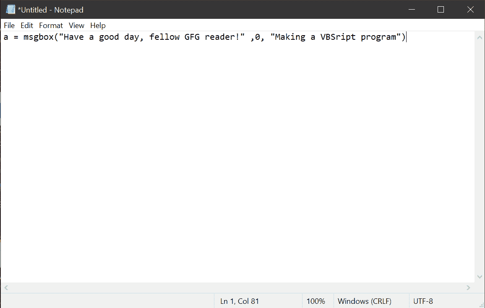
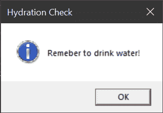
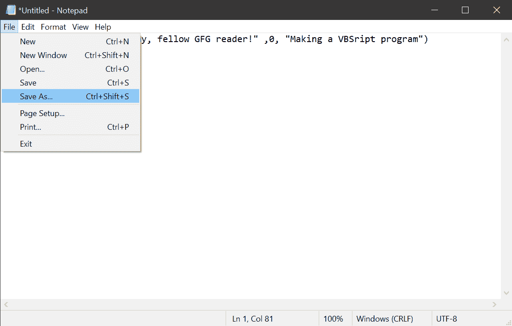
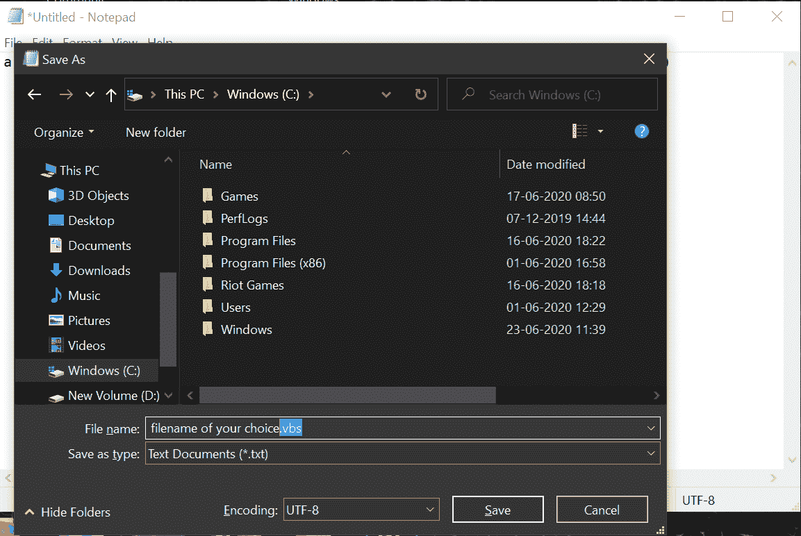
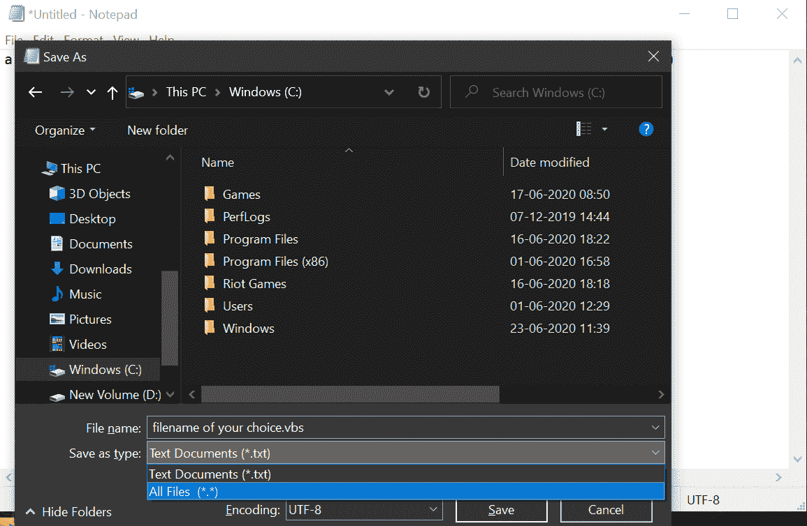
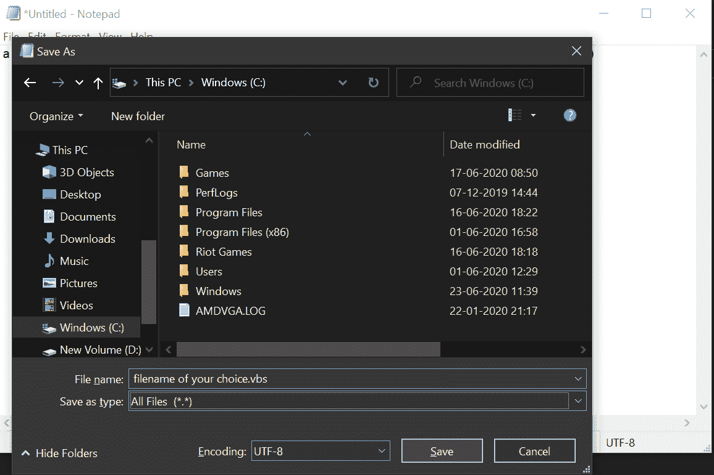
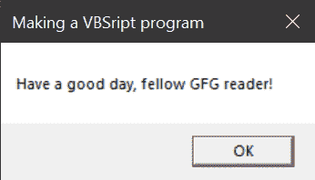

# 如何制作、保存和运行一个简单的 VBScript 程序？

> 原文：[https://www.geeksforgeeks.org/how-to-make-save-and-run-a-simple-vbscript-program/](https://www.geeksforgeeks.org/how-to-make-save-and-run-a-simple-vbscript-program/)

[VBScript](https://www.geeksforgeeks.org/vbscript-introduction/) 是流行的微软 Visual Basic 的轻量级脚本版本，顾名思义由微软开发。它用于开发动态网页。与 Visual Basic 编程语言相比，它要轻得多，但可以作为像 JavaScript 这样的脚本语言工作。要在客户端运行 VBScript，客户端必须使用 Internet Explorer，因为 VBScript 仍然不支持其他浏览器。

## 如何制作一个 VBScript 程序？

就像很多其他简单的脚本语言一样，VBScript 可以写在一个简单的文字编辑器上，像记事本等这样的软件（如记事本++、写字板等）。请参考以下步骤，更好地了解如何制作 VBScript 程序：

**第一步：** 打开自己选择的文字编辑器（这里用的是记事本）。



**第二步：** 现在，这里有一个简单的 VBScript 程序，它会让一个简单的消息对话框出现在屏幕上。VBScript 中这样一个程序的代码是：

```html
a = msgbox("Have a good day, fellow GFG reader!", 0, "Making a VBScript program")
```



**代码说明：** 只要遵循 VBScript 中的变量声明规则就可以放任何东西，而不是上面代码开头的“a”。实际上，我们可以通过以下方式破解和理解上述代码：

```html
put_any_Variable_name = msgbox("Your main text here", 0, "Your title text here")
```

要根据需要更改对话框的属性，请参考以下数据：

| code | attribute |
| :--- | :--- |
| 0 | Only the OK button will be displayed. |
| 1 | The OK and Cancel buttons will be displayed. |
| 2 | The abort, retry and ignore buttons will be displayed. |
| 3 | Yes, No and Cancel buttons will be displayed. |
| 4 | Yes and No buttons will be displayed. |
| 5 | Retry and Cancel buttons will be displayed. |
| 16 | The critical message icon will be displayed in the dialog box. |
| 32 | A warning query icon will be displayed in the dialog box. |
| 48 | A warning message icon will be displayed in the dialog box. |
| 64 | The information message icon will be displayed in the dialog box. |
| 0 | The first button will be the default button. |
| 256 | The second button will be the default button. |
| 512 | The third button will be the default button. |
| 4096 | System modal (basically all applications will stop working until the user responds to the dialog box). |

用上面提供的任何数字更改上面书写代码中的“0”。
要在对话框中获得多个上述属性，可以简单编写，例如：“0+16”，而不是上面代码中的“0”。
参考代码：

```html
hydro = msgbox("Remember to drink water!", 0+64, "Hydration Check")
```

将给出如下输出：



就这样，我们刚刚编写了一个基本的 VBScript 程序，它将显示一个对话框作为输出。现在开始保存这个程序。

## 如何保存一个 VBScript 程序？

按照下面给出的步骤保存 VBScript 程序：

**第一步：** 按键盘上的 `Ctrl + Shift + S`，或者在记事本窗口点击 `文件 > 另存为`，这将打开一个另存为对话框窗口，询问当前记事本文档的保存位置。



**第二步：** 现在为这个记事本文档写下你选择的任何文件名，但是一定要写 `.vbs` 作为其扩展名。一定要加 `.`。将文件名写入“文件名：”字段后。



**第三步：** 现在，更改“另存为类型：”字段中的值（`*.txt`）至“所有文件（`*.*`）”，通过在下拉菜单的帮助下点击它。



**第四步：** 最后，选择文件保存的合适位置后，点击保存。



## 如何运行一个 VBScript 程序？

现在，这是一件非常简单的事情，只需双击现在保存的 `.vbs` 文件从你保存它的地方，瞧！它将运行并给你以下输出：

