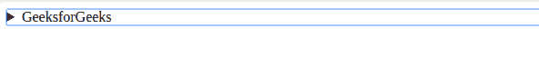

# 如何在 GitHub Wiki 页面中制作“剧透”文字？

> 原文：[https://www.geeksforgeeks.org/how-to-make-spoiler-text-in-github-wiki-pages/](https://www.geeksforgeeks.org/how-to-make-spoiler-text-in-github-wiki-pages/)

GitHub Wiki 页面支持 GitHub 风味 Markdown。点击此处了解更多关于 GitHub 风味 Markdown 的信息：
*   [掌握 Markdown](https://guides.github.com/features/mastering-markdown/)
*   [GitHub 风味 Markdown 规格](https://github.github.com/gfm/)

然而，在 GitHub 风味的 Markdown 中没有直接的方法来添加剧透文本。但是，有一个解决方法！

## 方法

Markdown 支持其中的 HTML 块。所以，我们可以用 HTML 的 [`<details>`](https://www.geeksforgeeks.org/html5-details-tag/) 和 [`<summary>`](https://www.geeksforgeeks.org/html-5-summary-tag/) 标签来创建一个剧透文字。“扰流板警告”的标题可在 [`<summary>`标签](https://www.geeksforgeeks.org/html-5-summary-tag/) 中指定。扰流板的其余部分必须在 [`<details>`标签](https://www.geeksforgeeks.org/html5-details-tag/) 内。只有点击“前方扰流板”标题才会显示扰流板。[`<summary>`标签](https://www.geeksforgeeks.org/html-5-summary-tag/) 中的文本是剧透标题。代码、图像、链接等可以在 GitHub 风味的 Markdown 之后，在 [`<details>`标签](https://www.geeksforgeeks.org/html5-details-tag/) 中使用。

## 例

### HTML

```html
<!DOCTYPE html>
<head>
<head>
    <title>
         “spoiler” text in github wiki pages
    </title>
</head>
<body>
    <details>
        <summary>GeeksforGeeks</summary>
         A Computer Science Portal for Geeks
    </details>         
</body>
</html>
```

### 输出

[`<details>`标记](https://www.geeksforgeeks.org/html5-details-tag/) 以及 [`<summary>`标记](https://www.geeksforgeeks.org/html-5-summary-tag/) 在 Markdown 中创建以下输出。


**注：** 以上输出直接来自 GitHub Wiki Pages 的 Markdown 预览。