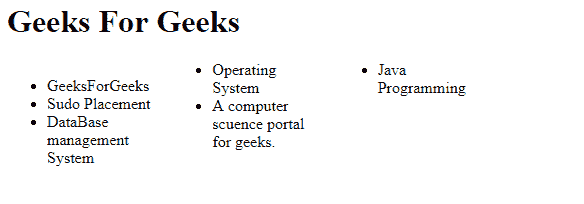

# 如何防止元素内的列断裂？

> 原文：[https://www.geeksforgeeks.org/how-to-prevent-column-break-within-an-element/](https://www.geeksforgeeks.org/how-to-prevent-column-break-within-an-element/)

我们可以通过使用 CSS `break-inside` 属性来防止元素内的列断裂。CSS 中的 `break-inside` 属性用于指定列在元素内部的分隔符。有时元素的内容会被夹在列之间。为了防止列断裂，我们应该使用 `break-inside` 属性来避免。

**语法：**

```css
column-break-inside: avoid;
```

**示例：** 本示例用于防止元素内的列断裂。

```html
<html>
<head>
    <style>
        .x {
            -moz-column-count: 3;
            column-count: 3;
            width: 30em;
        }
        .x li {
            -webkit-column-break-inside: avoid;
        }
    </style>
</head>
<body>
    <h1>Geeks For Geeks</h1>
    <div class='x'>
        <ul>
            <li>GeeksForGeeks</li>
            <li>Sudo Placement</li>
            <li>DataBase management System</li>
            <li>Operating System</li>
            <li>A computer science portal for geeks.</li>
            <li>Java Programming</li>
        </ul>
    </div>
</body>
</html>
```

**输出：**
