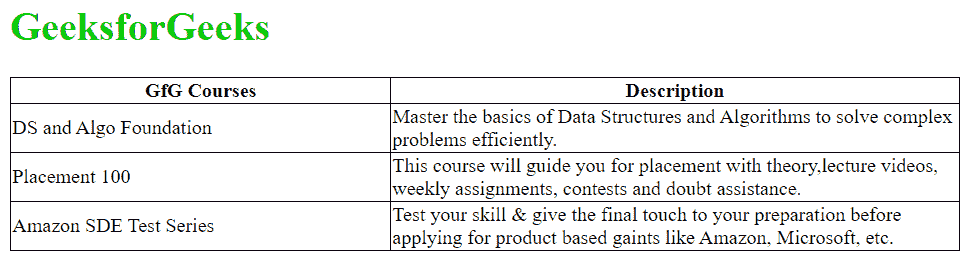

# 如何在表格中设置固定宽度？

> Original: [https://www.geeksforgeeks.org/How to set the fixed width of td in the table/](https://www.geeksforgeeks.org/how-to-set-fixed-width-for-td-in-a-table/)

在设计网页的过程中，对表格的要求是很正常的。HTML 提供了 [`<table>` 标签](https://www.geeksforgeeks.org/html-tables/) 来构造表并定义行和列，[`<tr>`](https://www.geeksforgeeks.org/html-tr-align-attribute/) 和 [`<td>`](https://www.geeksforgeeks.org/html-td-align-attribute/) 标签分别使用。

默认情况下，表格中的行和列的尺寸由浏览器以适合内容的方式自动调整。但是，可能存在需要固定列宽的情况。`<td>` 标签的宽度有多种固定方式。下面提到了其中的一些：

## 使用 width 属性

[`<td>` 标签](https://www.geeksforgeeks.org/html-td-width-attribute/)具有 `width` 属性来控制特定列的宽度。为此属性指定一个介于 0 到 100 之间的数字（基于百分比，或者您可以使用像素格式）。我们可以将列宽限制为表格总宽度的百分比。无效的宽度会被拒绝，并且在 **HTML5** 中不再支持。

```html
<!DOCTYPE html>
<html>
    <head>
        <title>
          Set up fixed width for
        </title>
        <meta charset="UTF-8" />
        <meta name="viewport" 
              content="width=device-width, 
                       initial-scale=1.0" />
        <style>
            table,
            th,
            td {
                border: 1px solid black;
                border-collapse: collapse;
            }
        </style>
    </head>
    <body>
        <h1 style="color: #00cc00;">
          GeeksforGeeks
        </h1>
        <!-- Making the table responsive -->
        <div style="overflow-x: auto;">
            <!-- Adding table in the web page -->
            <table width="50%">
                <tr>
                    <th>GfG Courses</th>
                    <th>Description</th>
                </tr>
                <tr>
                    <td width="40%">
                      DS and Algo Foundation
                    </td>
                    <td width="60%">
                      Master the basics of Data Structures
                      and Algorithms to solve complex 
                      problems efficiently.
                    </td>
                </tr>
                <tr>
                    <td width="40%">Placement 100</td>
                    <td width="60%">
                      This course will guide you for 
                      placement with theory,lecture videos,
                      weekly assignments, contests and doubt 
                      assistance.
                    </td>
                </tr>
                <tr>
                    <td width="40%">
                      Amazon SDE Test Series
                    </td>
                    <td width="60%">
                      Test your skill & give the final 
                      touch to your preparation before 
                      applying for product based against 
                      like Amazon, Microsoft, etc.
                    </td>
                </tr>
            </table>
        </div>
    </body>
</html>
```

## 使用 CSS

层叠样式表（CSS）被广泛用于装饰大型网页。使用 CSS，可以轻松修改 HTML 元素的样式。为了固定 `td` 标签的宽度，可以使用 nth-child CSS 来设置表格每一行中特定列的属性（由 `n` 的值确定）。

```html
<!DOCTYPE html>
<html>
    <head>
        <title>Set up fixed width for <td></title>
        <meta charset="UTF-8" />
        <meta name="viewport"
              content="width=device-width, 
                       initial-scale=1.0" />
        <style>
            table,
            th,
            td {
                border: 1px solid black;
                border-collapse: collapse;
            }
            table {
                width: 50%;
            }
            /* Fixing width of first 
               column of each row */
            td:nth-child(1) {
                width: 40%;
            }
            /* Fixing width of second 
               column of each row */
            td:nth-child(2) {
                width: 60%;
            }
        </style>
    </head>
    <body>
        <h1 style="color: #00cc00;">
          GeeksforGeeks
        </h1>
        <!-- Making the table responsive -->
        <div style="overflow-x: auto;">
            <!-- Adding table in the web page -->
            <table>
                <tr>
                    <th>GfG Courses</th>
                    <th>Description</th>
                </tr>
                <tr>
                    <td>DS and Algo Foundation</td>
                    <td>
                       Master the basics of Data Structures 
                       and Algorithms to solve complex 
                       problems efficiently.
                    </td>
                </tr>
                <tr>
                    <td>Placement 100</td>
                    <td>
                      Test your skill & give the final touch
                      to your preparation before applying for
                      product based against like Amazon, 
                      Microsoft, etc.
                    </td>
                </tr>
                <tr>
                    <td>Amazon SDE Test Series</td>
                    <td>
                      Test your skill & give the final touch 
                      to your preparation before applying for
                      product based gaints like Amazon, 
                      Microsoft, etc.
                    </td>
                </tr>
            </table>
        </div>
    </body>
</html>
```

## 使用 col 标签和 table-layout 属性

如果表格的每一行都应遵循相同的列属性，那么使用 `col` 标签来定义列属性是一个好主意。如果在 HTML 文档中第一次写入 `col` 标签并设置其属性，那么所有这些属性都引用表格中提到它的每一行的第一列。类似地，第二次使用 `col` 标签并定义其属性将影响表格每一行的第二列。此外，对于长文本，可以调整 CSS 属性 `table-layout: fixed;`。以下是实现方式。

```html
<!DOCTYPE html>
<html>
    <head>
        <title>Set up fixed width for</title>
        <meta charset="UTF-8" />
        <meta name="viewport" 
              content="width=device-width, 
                       initial-scale=1.0" />
        <style>
            table,
            th,
            td {
                border: 1px solid black;
                border-collapse: collapse;
            }
            table {
                width: 50%;
            }
            table.fixed {
                table-layout: fixed;
            }
            table.fixed td {
                overflow: hidden;
            }
        </style>
    </head>
    <body>
        <h1 style="color: #00cc00;">
          GeeksforGeeks
        </h1>
        <!-- Making the table responsive -->
        <div style="overflow-x: auto;">
            <!-- Adding table in the web page -->
            <table>
                <!-- Assigning width of first
                     column of each row as 40% -->
                <col style="width: 40%;" />
                <!-- Assigning width of second 
                     column of each row as 60% -->
                <col style="width: 60%;" />
                <tr>
                    <th>GfG Courses</th>
                    <th>Description</th>
                </tr>
                <tr>
                    <td>DS and Algo Foundation</td>
                    <td>
                      Master the basics of Data Structures
                      and Algorithms to solve complex 
                      problems efficiently.
                    </td>
                </tr>
            </table>
        </div>
    </body>
</html>
```

```html
<tr>
    <td>Placement 100</td>
    <td>
        This course will guide you for placement with theory, lecture videos, weekly assignments, contests and doubt assistance.
    </td>
</tr>
<tr>
    <td>Amazon SDE Test Series</td>
    <td>
        Test your skill & give the final touch to your preparation before applying for product based against like Amazon, Microsoft, etc.
    </td>
</tr>
</table>
</div>
</body>
</html>
```

**Output:** The output of each method will be the same.



HTML 是网页的基础，是通过结构化网站和 web apps 用于网页开发的。跟随本 [HTML 教程](https://www.geeksforgeeks.org/html-tutorials/)和 [HTML 示例](https://www.geeksforgeeks.org/html-examples/)可以从头开始学习 HTML。

CSS 是网页的基础，是通过样式化网站和 web apps 来进行网页开发的。遵循本 [CSS 教程](https://www.geeksforgeeks.org/css-tutorials/)和 [CSS 示例](https://www.geeksforgeeks.org/css-examples/)可以从头开始学习 CSS。