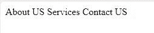

# 如何使用 UI-Router 设置或更新页面标题？

> 原文: [https://www.geeksforgeeks.org/how-to-set-or-update-page-title-using-ui-router/](https://www.geeksforgeeks.org/how-to-set-or-update-page-title-using-ui-router/)

**UI-Router** 是一个客户端路由器，专为单页应用程序（SPA）而设计。当用户在单页应用程序中浏览时，客户端路由器会更新浏览器的 URL。

AngularJS 允许你在不同阶段更改页面标题。让我们看看如何更改标题：

*   在我们的 `$state` 中使用 `resolve` 函数来设置标题。
*   使用 `$rootScope.$on(…)` 函数。
*   通过在我们的控制器中更新标题，这对于动态页面标题（如博客文章等）非常有用。

以下是使用 UI-Router 设置页面标题的方法。

## 使用解析 (Resolve)

安装 **angular-ui-title** 并像往常一样追加到你的 Angular 项目中，然后别忘了在你的父应用模块中注入 **ui-router-title**。

```javascript
angular.module('codeSide', [
    'ui.router', 'ui.router.title'
])
.config(['$stateProvider', '$urlRouterProvider', function($stateProvider, $urlRouterProvider) {
    $stateProvider
        .state('home', {
            url: '/',
            templateUrl: 'home/home.html',
            controller: 'HomeController',
            resolve: {
                $title: function() { return 'Homepage'; }
            }
        })
        // other states here
        .....
    ]);
}]);
```

在你的 `index` 文件中，代码应该是：

```html
<head>
    <title ng-bind="($title || 'Home') + ' :: CodeBySide'">
        CodeBySide
    </title>
</head>
```

**输出:**


在上面的代码中，我们的标题不是动态生成的。

### 获取要动态生成的标题

`angular-ui-router` 通过 `$rootScope` 使 `$title` 变量在整个站点可用。

**示例:**

```javascript
codeObject.$loaded()
    .then(function(data) {
        $rootScope.$title = data.title;
        // update title with detail page
        // other code here
    });
```

## 使用 `$rootScope.$on(…)`

在这种方法中，**ui-router** 允许在我们的 `$state` 配置中添加任意键值对，这些数据可以随时随地被引用。

**示例:**

```javascript
.state('detail', {
    url: '/codes/:codeId',
    templateUrl: 'codes/detail.html',
    controller: 'DetailController',
    data: {
        title: 'Code Detail'
    }
})
```

通过这种方法，我们需要在应用的 `.run()` 函数中添加一个额外的中间件。

```javascript
.run(['$rootScope', '$state', function($rootScope, $state) {
    $rootScope.$on('$stateChangeSuccess', function() {
        $rootScope.title = $state.current.data.title;
    });
}])
```

在这种方法的 `index` 文件中，将 `$title` 变量替换为 `title`：

```html
<head>
    <title ng-bind="(title || 'Home') + ' :: CodeBySide'">
        CodeBySide
    </title>
</head>
```

**输出:**


然后，对上面的代码片段稍加修改，让我们开始运行：

```javascript
codeObject.$loaded()
    .then(function(data) {
        $rootScope.title = data.title;
        // update title with detail page
        // many code here
    });
```