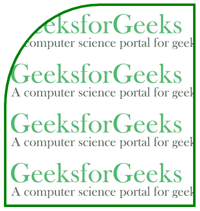
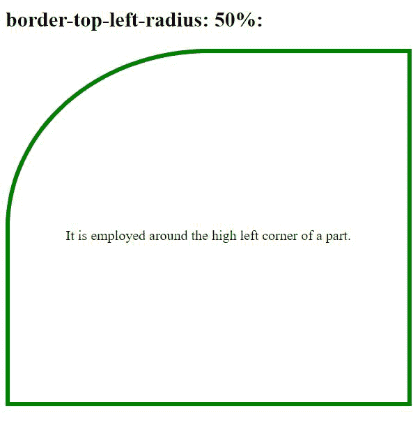

# 左上角的形状如何设置百分比？

> 原文: [https://www.geeksforgeeks.org/how-to-set-the-shape-of-the-top-left-corner-in-percentage/](https://www.geeksforgeeks.org/how-to-set-the-shape-of-the-top-left-corner-in-percentage/)

借助 [`border-top-left-radius`](https://www.geeksforgeeks.org/css-border-top-left-radius-property/) 属性我们可以圆化左上角的形状。`border-top-left-radius` 属性用于设置元素的左上角。

该属性接受一个或两个值，这些值勾勒出 1/4 椭圆的半径，该椭圆定义了外部边框边缘的角的形状（见下图）。第一个值是水平半径，第二个值是垂直半径。如果第二个值被忽略，则它与第一个值相同。如果任一长度为零，则角是方形的，而不是圆形的。

**语法:**

```css
border-top-left-radius: length | % | initial | inherit;
```

水平半径的百分比取决于边框盒子的宽度，而垂直半径的百分比取决于边框盒子的高度。负值不允许作为此属性的值。

### 示例 1

```html
<!DOCTYPE html>
<html>
<head>
    <style>
    .gfg {
         border: 5px solid green;
         width:60%;
         text-align:center;
         height:400px;
         border-top-left-radius: 50%;
         background: url(https://media.geeksforgeeks.org/wp-content/uploads/20190405121202/GfGLH.png);
    }
    </style>
</head>
<body>
    <div class="gfg"></div>
</body>
</html>
```

**输出:**



### 示例 2

```html
<!DOCTYPE html>
<html>
   <head>
      <style> 
         #GFG{
         border: 5px solid green;
         width:60%;
         text-align:center;
         height:400px;
         border-top-left-radius: 50%;
         }
      </style>
   </head>
   <body>
      <h2>border-top-left-radius: 50%:</h2>
      <div id="GFG">
         <p style="margin-top:200px;">
          It is employed around the high left
          corner of a part.
         </p>
      </div>
   </body>
</html>
```

**输出:**

