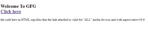

# 如何指定目标 URL 针对什么媒体/设备进行优化？

> 原文: [https://www.geeksforgeeks.org/how-to-specify-what-media-device-the-target-url-is-optimized-for/](https://www.geeksforgeeks.org/how-to-specify-what-media-device-the-target-url-is-optimized-for/) 指定优化了什么媒体设备目标 url

HTML 的 `media` 属性用于指定浏览器，链接文档针对哪些设备进行了优化。这个属性通常用于 CSS 样式表，但是也可以用于简单的 HTML 构建的网页。该属性允许用户从多种设备中进行选择，并且可以接受多个值。该属性用于指定目标网址是为特殊设备(如 iPhone、安卓等)、语音或打印媒体、投影仪、电视等设计的。

**注意:** 只有当 `href` 属性用作 `href` 指定链接文档时，才能使用该属性，因此 `media` 属性用于指定链接文档将如何以及在哪些设备中出现并兼容。

我们可以指定的各种设备值如下:

<figure class="table">

| **序号** | **值** | **描述** |
| :--- | :--- | :--- |
| 1。 | `all` | 如果未指定，则为默认值。它最适合所有媒体类型的设备。语法-`<a href="#" media="all" target="_blank">点击此处</a>` |
| 2。 | `screen` | 用于电脑屏幕、智能手机等。语法-`<a href="#" media="screen" target="_blank">点击此处</a>` |
| 3。 | `speech` | 它是用于屏幕的——做“朗读”的读者大声朗读页面。语法-`<a href="#" media="speech" target="_blank">点击此处</a>` |
| 4。 | `print` | 用于打印预览模式/打印页面的模式。语法-`<a href="#" media="print" target="_blank">点击此处</a>` |
| 5。 | `tv` | 用于电视类设备(低分辨率，或者滚动能力有限的设备)。语法-`<a href="#" media="tv" target="_blank">点击此处</a>` |

</figure>

我们还可以在指定媒体设备类型的同时添加一些额外的特定信息，以显示链接文档的优化方式。

<figure class="table">

| **序号** | **值** | **描述** |
| :--- | :--- | :--- |
| 1。 | `width` | 用于指定目标媒体显示区域的宽度。语法-`<a href="#" media="screen and (min-width:100px)" target="_blank">点击此处</a>` |
| 2。 | `height` | 用于指定目标媒体显示区域的高度。语法-`<a href="#" media="screen and (max-height:700px)" target="_blank">点击此处</a>` |
| 3。 | `device-width` | 用于指定目标媒体显示区域的宽度。语法-`<a href="#" media="screen and (device-width:100px)" target="_blank">点击此处</a>` |
| 4。 | `aspect-ratio` | 用于指定目标媒体显示区域的宽高比。语法-`<a href="#" media="screen and (aspect-ratio:4/3)" target="_blank">点击此处</a>` |
| 5。 | `device-height` | 用于指定目标媒体显示/纸张的高度。语法-`<a href="#" media="screen and (device-height:400px)" target="_blank">点击此处</a>` |
| 6。 | `orientation` | 用于指定媒体设备显示器/纸张的方位。语法-`<a href="#" media="all and (orientation:landscape)" target="_blank">点击此处</a>` |
| 7。 | `device-aspect-ratio` | 用于指定媒体设备显示器/纸张的设备宽高比。语法-`<a href="#" media="screen and (aspect-ratio:4/3)" target="_blank">点击此处</a>` |
| 8。 | `color` | 用于指定媒体设备显示的每种颜色的位数。语法-`<a href="#" media="screen and (color:1)" target="_blank">点击此处</a>` |
| 9。 | `color-index` | 用于指定媒体设备显示可以支持的颜色数量。语法-`<a href="#" media="screen and (min-color-index:250)" target="_blank">点击此处</a>` |
| 10。 | `resolution` | 用于指定媒体设备显示器/纸张的像素密度。语法-`<a href="#" media="print and (resolution:400dpi)" target="_blank">单击此处</a>` |

</figure>

## 语法

```html
<a href="#" media="all" target="_blank"></a>
```

下面是说明如何指定媒体属性的代码。

## 示例

```html
<!DOCTYPE html>
<html>

<body>
  <h2>Welcome To GFG</h2><br>
  <a href="https://ide.geeksforgeeks.org/"
     media="all and (aspect-ratio:16/9)"
     target="_blank">
    Click here
  </a>

  <p>
    the code here in HTML specifies that the
    link attached is valid for "ALL" media
    devices and with aspect-ratio=16:9
  </p>

</body>

</html>
```



Microsoft edge 上的示例输出。