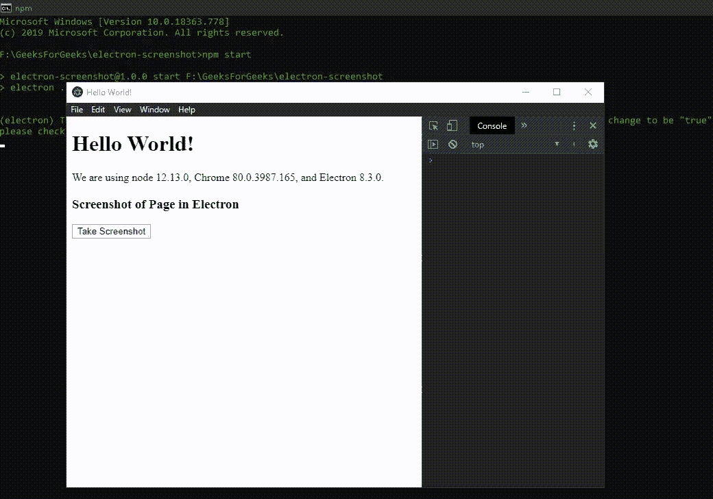

# 如何在 Electron 中截图？

> 原文：[https://www.geeksforgeeks.org/how-to-take-screenshots-in-electronjs/](https://www.geeksforgeeks.org/how-to-take-screenshots-in-electronjs/)

[`Electron.js`](https://www.geeksforgeeks.org/introduction-to-electronjs/) 是一个开源框架，用于使用能够在 `Windows`、`macOS` 和 `Linux` 操作系统上运行的 HTML、CSS 和 JavaScript 等 Web 技术构建跨平台原生桌面应用。它将 Chromium 引擎和 [`Node.js`](https://www.geeksforgeeks.org/introduction-to-nodejs/) 结合成一个单一的运行时。

Electron 支持在桌面应用中从 `Web` 页面内生成 PDF 文件和[打印文件](https://www.geeksforgeeks.org/printing-in-electronjs/)。除了这些功能，Electron 还提供了一种方法，通过该方法，我们可以拍摄 `Web` 页面的截图，并使用 `BrowserWindow` 对象和 `webContents` 属性的实例方法将其作为图像文件保存到本机系统上。Electron 内部使用 `NativeImage` 类处理图像，因此我们还要求 `nativeImage` 模块的实例方法将相应的 `NativeImage` 转换为 `PNG` 或 `JPEG` 格式，然后才能保存到本机系统中。对于[将文件保存到本机系统](https://www.geeksforgeeks.org/save-files-in-electronjs/)，我们将使用 Electron 中 `dialog` 模块的实例方法。本教程将演示如何在 Electron 中拍摄网页截图，并将它们保存到原生系统中。

我们假设您熟悉上述链接中介绍的先决条件。Electron 要工作，[`Node.js`](https://www.geeksforgeeks.org/introduction-to-nodejs/) 和 [`npm`](https://www.geeksforgeeks.org/node-js-npm-node-package-manager/) 需要预装在系统中。

## 设置

**示例：** 按照[在 Electron 中生成 PDF](https://www.geeksforgeeks.org/generate-pdf-in-electronjs/) 中给出的步骤，设置基本的 Electron 应用程序。复制文章中提供的 `main.js` 文件和 `index.html` 文件的样板代码。还要对 `package.json` 文件进行必要的更改，以启动 Electron 应用程序。我们将继续使用相同的代码库构建我们的应用程序。设置电子应用程序所需的基本步骤保持不变。

**package.json:**

```json
{
  "name": "electron-screenshot",
  "version": "1.0.0",
  "description": "Screenshot in Electron",
  "main": "main.js",
  "scripts": {
    "start": "electron ."
  },
  "keywords": [
    "electron"
  ],
  "author": "Radhesh Khanna",
  "license": "ISC",
  "dependencies": {
    "electron": "^8.3.0"
  }
}
```

根据项目结构创建 `assets` 文件夹。我们将使用 `assets` 文件夹作为默认路径来存储应用程序拍摄的截图图像。

**输出：** 此时，我们的基本 Electron 应用程序设置完毕。启动应用程序后，我们应该会看到以下结果。

[](https://media.geeksforgeeks.org/wp-content/uploads/20200512225834/Output-1105.png)

## Electron 截图

`BrowserWindow` 实例、`webContents` 属性和 `dialog` 模块是 `Main` 进程的一部分。要在 `Renderer` 进程中导入和使用 `BrowserWindow` 对象和 `dialog` 模块，我们将使用 Electron `remote` 模块。

### index.html

在该文件中添加以下片段。`Screenshot` 按钮还没有任何相关功能。要进行更改，请在 `index.js` 文件中添加以下代码。

```html
<h3>Screenshot of Page in Electron</h3>
<button id="screenshot">
  Take Screenshot
</button>
```

### index.js

在该文件中添加以下代码片段。

```javascript
const electron = require("electron");
const BrowserWindow = electron.remote.BrowserWindow;
const path = require("path");
const fs = require("fs");

// Importing dialog module using remote
const dialog = electron.remote.dialog;

// let win = BrowserWindow.getAllWindows()[0];
let win = BrowserWindow.getFocusedWindow();

var screenshot = document.getElementById("screenshot");
screenshot.addEventListener("click", (event) => {
    win.webContents
        .capturePage({
            x: 0,
            y: 0,
            width: 800,
            height: 600,
        })
        .then((img) => {
            dialog
                .showSaveDialog({
                    title: "Select the File Path to save",

                    // Default path to assets folder
                    defaultPath: path.join(__dirname, "../assets/image.png"),

                    buttonLabel: "Save",

                    // Restricting the user to only Image Files.
                    filters: [
                        {
                            name: "Image Files",
                            extensions: ["png", "jpeg", "jpg"],
                        },
                    ],
                    properties: [],
                })
                .then((file) => {
                    // Stating whether dialog operation was cancelled or not.
                    console.log(file.canceled);
                    if (!file.canceled) {
                        console.log(file.filePath.toString());

                        // Creating and Writing to the image.png file
                        // Can save the File as a jpeg file as well,
                        // by simply using img.toJPEG(100);
                        fs.writeFile(file.filePath.toString(), img.toPNG(), "base64", function (err) {
                            if (err) throw err;
                            console.log("Saved!");
                        });
                    }
                })
                .catch((err) => {
                    console.log(err);
                });
        })
        .catch((err) => {
            console.log(err);
        });
});
```

## 代码解释

`win.webContents.capturePage([rect])` 实例方法简单地抓取 `rect` 对象指定的网页截图。省略 `rect` 对象将捕获整个可见的 `Web` 页面，即整个可见的 `BrowserWindow` 实例。它接受以下参数。

*   `rect`: `Object` (可选) `rect` 对象。它由定义矩形及其在网页/屏幕上的位置所需的以下参数组成。
    *   `x`: `Integer` `X` 矩形原点的坐标。在这种情况下，X 坐标表示要捕捉的网页/屏幕的坐标。
    *   `y`: `Integer` 矩形原点的 `Y` 坐标。在这种情况下，Y 坐标表示要捕捉的网页/屏幕的坐标。
    *   `width`: `Integer` 矩形的 `width`。在这种情况下，它表示要捕捉的网页/屏幕的 `width`。
    *   `height`: `Integer` 矩形的 `height`。在这种情况下，它表示要捕捉的网页/屏幕的 `height`。

`win.webContents.capturePage()` 实例方法返回一个 `Promise`，并在成功截图时用 `NativeImage` 实例解析。我们需要使用 `nativeImage` 模块的实例方法将这个 `NativeImage` 实例转换为 `JPEG` 或 `PNG`，然后才能将其保存在本机系统上。

*   `image.toPNG([options])` 此实例方法通过返回包含图像的 `PNG` 编码数据的 Node.js Buffer，将 `NativeImage` 实例转换为 `PNG` 格式。我们将使用此方法返回的缓冲区将图像写入 `.png` 文件，如代码所示使用 [`fs`](https://www.geeksforgeeks.org/node-js-file-system/) 模块。PNG 文件的默认编码是 `base64`。它接受以下参数。
    *   `options`: `Object` (可选) `options` 对象由单个参数组成，即 `scaleFactor`: `Double` (可选) 表示图像的比例因子（缩放）。默认情况下，取值为 `1.0`。
*   `image.toJPEG(quality)` 此实例方法通过返回包含图像的 `JPEG` 编码数据的 Node.js Buffer，将 `NativeImage` 实例转换为 `JPEG` 格式。我们将使用此方法返回的缓冲区将图像写入 `.jpeg` 文件，如代码所示使用 [`fs`](https://www.geeksforgeeks.org/node-js-file-system/) 模块。JPEG 文件的默认编码是 `base64`。它接受以下参数。
    *   `quality`: `Integer` 该值不能为空。它可以接受介于 `0` 和 `100` 之间的值。该值代表图像的质量因子，`0` 为最低质量，`100` 为最高质量图像。

`dialog` 模块的 `dialog.showSaveDialog(options)` 实例方法用于与原生文件系统交互，打开一个系统对话框，通过获取用户指定的文件路径将文件保存在本地。默认情况下，我们将指定 `assets` 文件夹的文件路径，并将图像文件保存为 `PNG` 格式，名称为 `image.png`。有关如何限制用户使用 `dialog` 的 PNG/JPEG 格式和属性的更多信息，请参考 [Electron 文档中的保存文件](https://www.geeksforgeeks.org/save-files-in-electronjs/)。

在 `Renderer` 进程中获取当前 `BrowserWindow` 实例，可以使用 `BrowserWindow` 对象提供的一些*静态*方法。

*   `BrowserWindow.getAllWindows()`: 此方法返回一个活动/打开的 `BrowserWindow` 实例数组。在这个应用程序中，我们只有一个活动的 `BrowserWindow` 实例，它可以直接从数组中引用，如代码所示。
*   `BrowserWindow.getFocusedWindow()`: 此方法返回在应用程序中聚焦的 `BrowserWindow` 实例。如果没有找到当前浏览器窗口实例，则返回 `null`。在这个应用程序中，我们只有一个活动的 `BrowserWindow` 实例，可以使用这个方法直接引用它，如代码所示。

## 输出

[](https://media.geeksforgeeks.org/wp-content/uploads/20200603213524/Output-15.gif)