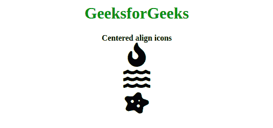

# 如何瞄准所有 Font Awesome 图标并居中对齐？

> 原文: [https://www.geeksforgeeks.org/how-to-target-all-font-awesome-icons-and-align-center/](https://www.geeksforgeeks.org/how-to-target-all-font-awesome-icons-and-align-them-center/)

Font Awesome 是一个很棒的工具包，开发者可以用它来获取基于 CSS 和 LESS 的图标。网上还有其他图标包，但 Font Awesome 在开发者社区更受欢迎。它有大量免费使用的图标。

最喜欢的 Font Awesome 图标居中方式是给每个 `<i>` 标签分配一个 `center` 类。将宽度设置为 100%，让每个图标水平覆盖 100% 的区域。此外，文本对齐然后根据所使用的宽度将图标居中。

如果我们想在我们的窗口上定位我们的 Font Awesome 图标，并使用以下方法将它们对齐到中心。

## 示例 1：在所有 `<i>` 标签中添加自定义类

此方法可用于页面上的所有 Font Awesome 图标。

**程序：**

```html
<!DOCTYPE html>
<html>
    <head>
        <script src=
"https://kit.fontawesome.com/a6e2755b4d.js" 
                crossorigin="anonymous">
        </script>
        <style>
            .center {
                text-align: center;
                width: 100%;
            }
        </style>
    </head>
    <body>
        <center>
            <h1 style="color: green;">
              GeeksforGeeks
            </h1>
            <b>
                Centered align icons
            </b>
        </center>
        <br>
        <i class="fas fa-fire fa-3x center"></i>
        <i class="fas fa-water fa-3x center"></i>
        <i class="fas fa-disease fa-3x center"></i>
    </body>
</html>
```

**输出：** 

## 示例 2：在 `div` 标签中添加自定义类

此方法只能用于专门放置 Font Awesome 图标的网站部分。

**程序：**

```html
<!DOCTYPE html>
<html>
    <head>
    <script src=
"https://kit.fontawesome.com/a6e2755b4d.js" 
            crossorigin="anonymous">
    </script>
    <style>
    .center {
        text-align:center;
        width:100%;
    }
    </style>
    </head>
    <body>
        <center>
            <h1 style="color: green;">
              GeeksforGeeks
            </h1>
            <b>
                Centered align icons
            </b>
        </center>
        <br>
        <div class="center">
            <i class="fas fa-fire fa-3x"></i>
            <br>
            <i class="fas fa-water fa-3x"></i>
            <br>
            <i class="fas fa-disease fa-3x"></i>
        </div>
    </body>
</html>
```

**输出：** 

## 示例 3：为特定部分添加 HTML `<center>` 标签

此方法只能用于专门放置 Font Awesome 图标的网站部分。

```html
<!DOCTYPE html>
<html>
    <head>
    <script src=
"https://kit.fontawesome.com/a6e2755b4d.js" 
            crossorigin="anonymous">
    </script>
    </head>
    <body>
        <center>
            <h1 style="color: green;">
              GeeksforGeeks
            </h1>
            <b>
                Centered align icons
            </b>
            <br>
            <i class="fas fa-fire fa-3x"></i>
            <br>
            <i class="fas fa-water fa-3x"></i>
            <br>
            <i class="fas fa-disease fa-3x"></i>
        </center>
    </body>
</html>
```

**输出：** 