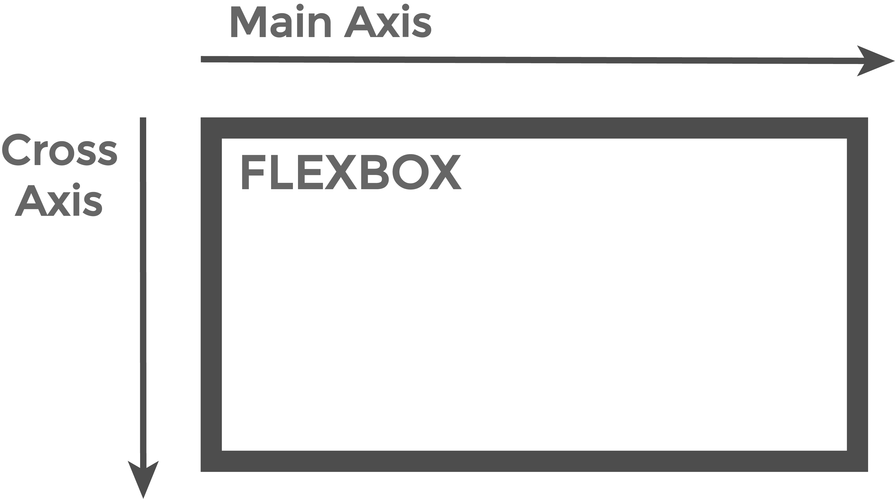

# 如何将 flexbox 垂直和水平对中？

> 原文：[https://www.geeksforgeeks.org/how-to-vertically-and-horizontally-align-flexbox-to-center/](https://www.geeksforgeeks.org/how-to-vertically-and-horizontally-align-flexbox-to-center/)

我们已经知道，flexbox 是一个模型，而不仅仅是一个 CSS 属性。
下图为一个有两个轴的方框，一个是`主轴`（即横轴），一个是`交叉轴`（即纵轴）。为了在水平方向和垂直方向上对准中间的弹性箱，我们需要在这两个轴上工作。



所以，首先我们需要记住这里的两个 CSS 属性，它们是：
*   `justify-content`
*   `align-items`

第一个属性，即`justify-content`，是在主轴上对齐任何 HTML 元素，主轴是水平轴。第二个属性`align-items`是在交叉轴上对齐任何 HTML 元素，交叉轴是垂直轴。
因此，要将一个 HTML 元素水平和垂直对齐在屏幕的中心，我们必须将这两个属性的值都设置为`center`。

**语法：**

```css
.gfg-box {
    display: flex;
    justify-content: center;
    align-items: center;
}
```

## 超文本标记语言

```html
<!DOCTYPE html>
<html lang="en">

<head>
    <meta charset="UTF-8">
    <title>Flexbox</title>
    <style>
        html,
        body {
            margin: 0;
            padding: 0;
            height: 100%;
        }

        .gfg-box {
            display: flex;
            justify-content: center;
            align-items: center;
            height: 100%;
        }

        .box {
            padding: 8px 35px;
            font-size: 30px;
            color: green;
            border: 10px solid green;
        }
    </style>
</head>

<body>
    <div class="gfg-box">
        <div class="box">
            <h1>GeeksforGeeks</h1>
        </div>
    </div>
</body>

</html>
```

**输出：**


**注意：** `height`属性在`HTML`的`body`和`.gfg-box`中应该有`100%`的值。
要了解更多关于 flexbox 及其所有属性的信息，请参考本文。