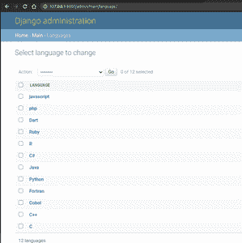
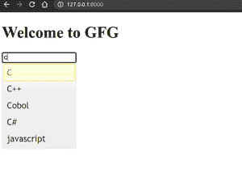

# 在 Django 中实现输入字段的搜索自动完成

> 原文: [https://www.geeksforgeeks.org/implement-search-autocomplete-for-input-fields-in-django/](https://www.geeksforgeeks.org/implement-search-autocomplete-for-input-fields-in-django/)

Django 是一个基于 Python 的高级网络框架，允许快速开发和干净、实用的设计。它也被称为电池内置框架，因为 Django 为一切提供内置功能，包括 Django 管理界面、默认数据库——`sqllite 3` 等。今天我们将在 Django 创建一个笑话应用。

在本文中，我们将学习如何从 Django 模型中获取数据，并为其提供自动完成等功能。我们将使用 jQuery 进行自动完成。

## 安装

首先，安装 Django。

```html
pip3 install django
```

## 创建项目和应用

首先，我们将创建新项目。

```html
django-admin startproject AutoC
```

```html
cd AutoC
```

然后我们将创建新的应用程序。

```html
python3 manage.py startapp main
```

然后在 `settings.py` 中添加应用名称到 `INSTALLED_APPS`。


## `models.py`

```python
from django.db import models

# Create your models here.
class Language(models.Model):
    name = models.CharField(max_length=20)

    def __str__(self):
        return f"{self.name}"
```

然后为了创建数据库表，我们必须进行迁移。

```html
python3 manage.py makemigrations
```

```html
python3 manage.py migrate
```

我在表格中添加了这些语言。



## `views.py`

```python
from django.shortcuts import render
from .models import Language

# Create your views here.
def home(request):
    languages = Language.objects.all()
    return render(request,'main/index.html',{"languages":languages})
```

## 创建模板

然后在 app 内创建新目录 `templates`，在里面创建另一个目录 `main`。

然后创建新文件 `index.html`。

```html
<!DOCTYPE html>
<html>
<head>
    <title>AutoComplete</title>
    <script src="https://ajax.googleapis.com/ajax/libs/jquery/1.7.1/jquery.js"></script>
    <script src="https://ajax.googleapis.com/ajax/libs/jqueryui/1.8.16/jquery-ui.js"></script>
    <link href="http://ajax.googleapis.com/ajax/libs/jqueryui/1.8.16/themes/ui-lightness/jquery-ui.css" rel="stylesheet" type="text/css" />
</head>
<body>
    <h1>Welcome to GFG</h1>
    <input type="text" id="tags">
    <script>
  $( function() {
    var availableTags = [
        
            "{{language.name}}",
        
    ];
    $( "#tags" ).autocomplete({
      source: availableTags
    });
  } );
  </script>
</body>
</html>
```

## 配置 URL

然后创建新文件 `urls.py`。

```python
from django.urls import path
from .views import  *

urlpatterns = [
    path('', home,name="home")
]
```

然后在我们的项目 `urls.py` 中添加应用的 URL。

`AutoC/urls.py`

```python
from django.contrib import admin
from django.urls import path,include

urlpatterns = [
    path('admin/', admin.site.urls),
    path('',include("main.urls"))
]
```

## 运行应用程序

Windows 操作系统:

```html
python manage.py runserver
```

Linux:

```html
python3 manage.py runserver
```

