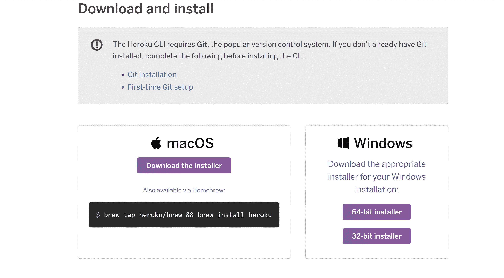
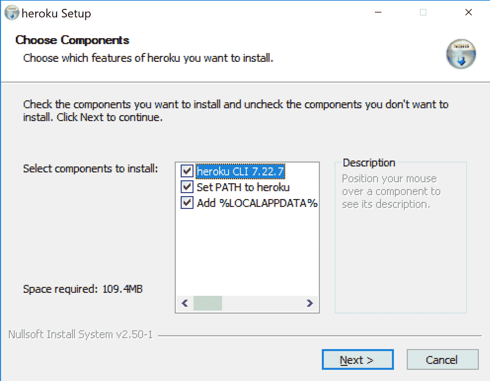
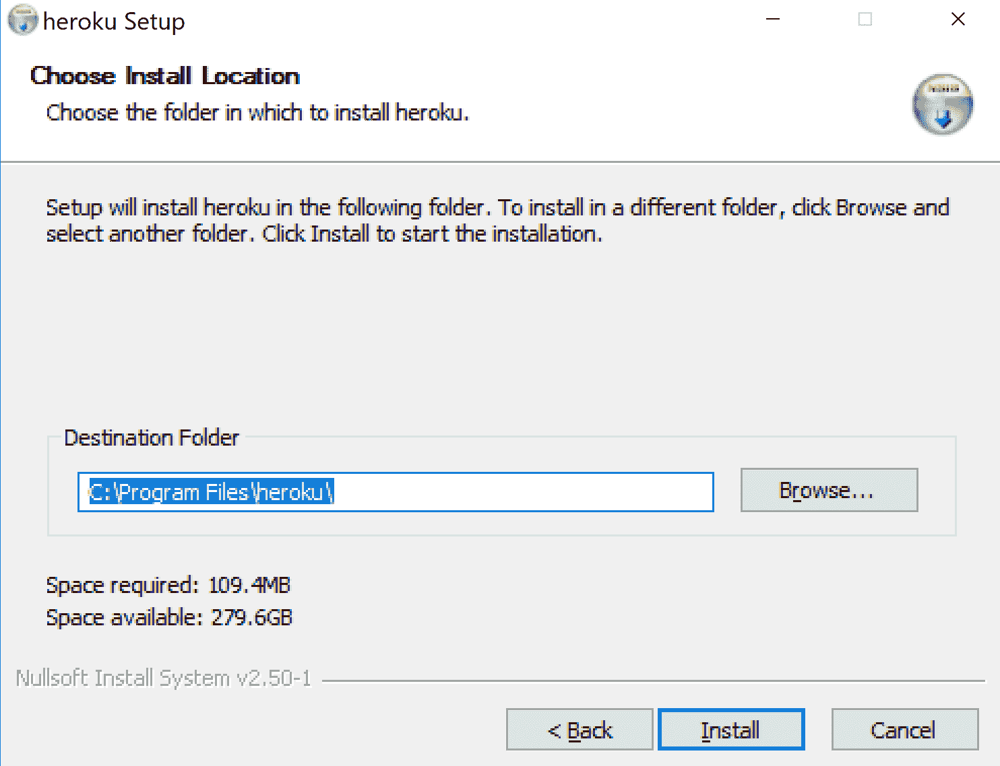
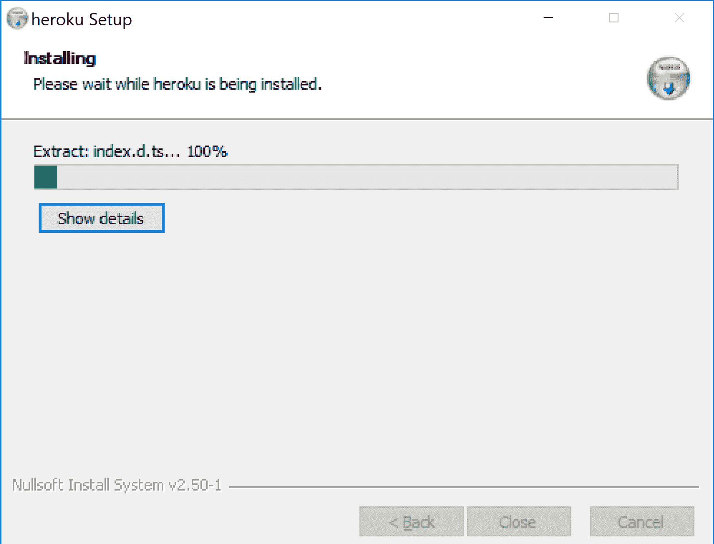
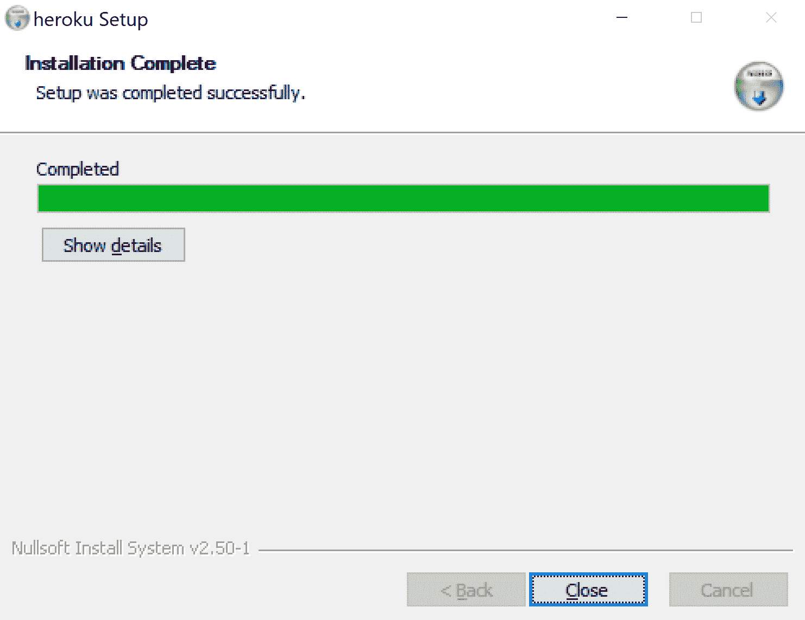
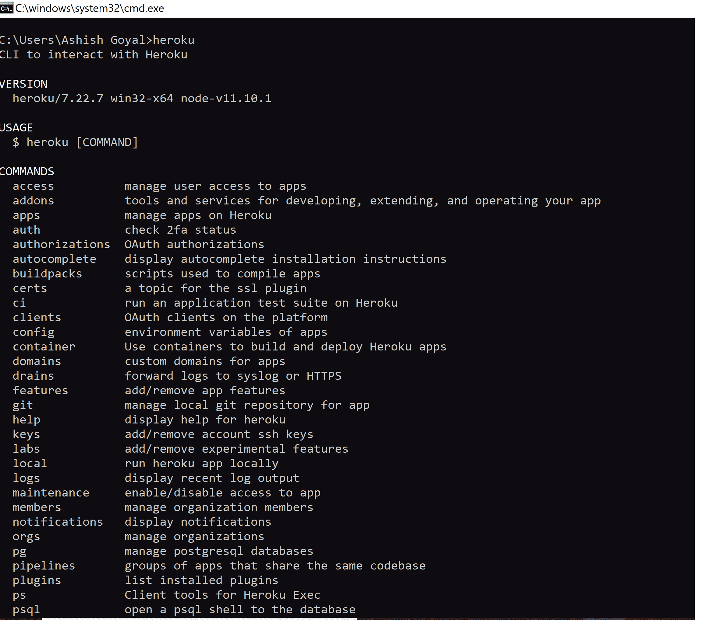
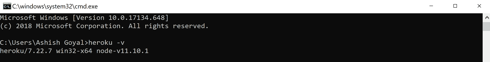

# 在 Windows 机器上安装 Heroku CLI

> 原文：[https://www.geeksforgeeks.org/introduction-and-installation-of-heroku-cli-on-windows-machine/](https://www.geeksforgeeks.org/introduction-and-installation-of-heroku-cli-on-windows-machine/)

**Heroku** 是基于云的应用部署和管理服务。
Heroku 致力于基于容器的设计系统，这些智能容器被称为 **dynos**。
它在各种 dyno 内部运行应用程序，每个 dyno 彼此分离。

## 在 Windows 机器上安装 Heroku

### 步骤 1：下载 Windows 安装程序

根据系统配置从[这里](https://devcenter.heroku.com/articles/heroku-cli#download-and-install)下载适合你 Windows 安装的安装程序。



### 步骤 2：在系统上运行安装程序

现在，点击安装程序文件，它会要求从以下选项中选择组件。

```
Heroku cli
Adding heroku to system path
Adding local data
```

确保你检查了所有的选项。现在点击“下一步”按钮。


### 步骤 3：设置目标文件夹

默认路径为系统 C 盘的路径。可以使用“浏览”按钮更改默认安装路径。


### 步骤 4：安装

点击“安装”后，它将开始将 `Heroku CLI` 安装到目标文件夹，如下图所示：


几秒钟后，`Heroku CLI` 将完全安装到系统中。



`Heroku` 命令行界面已成功安装在您的系统上。要进行验证，请在命令提示符或终端中运行以下命令。

```
heroku
```



检查 `Heroku` 版本，在终端运行以下命令：

```
heroku -v
```



因此，`Heroku` 命令行界面已正确安装到您的系统中。

### 步骤 5：注册 Heroku 服务

在[这里](https://signup.heroku.com)创建一个 `Heroku` 服务的帐户。


成功为 `Heroku` 服务创建帐户后，我们将通过 `Heroku CLI` 登录。

#### 通过终端登录 Heroku CLI

在终端运行以下命令通过 `Heroku CLI` 登录：

```
heroku login
```

现在，终端会要求按“任意键”将进程重定向到浏览器或按“Q”退出登录进程。

按任意键后，它会将你重定向到浏览器，如下图。


成功登录账号后，浏览器屏幕上会显示如下消息：


#### 通过命令提示符登录的另一种方法

要做到这一点，请在终端运行以下命令：

```
heroku login -i
```


成功登录后，您现在可以使用 `Heroku CLI` 进入您的系统。

`Heroku` 命令行界面已成功安装并初始化到您的系统中。