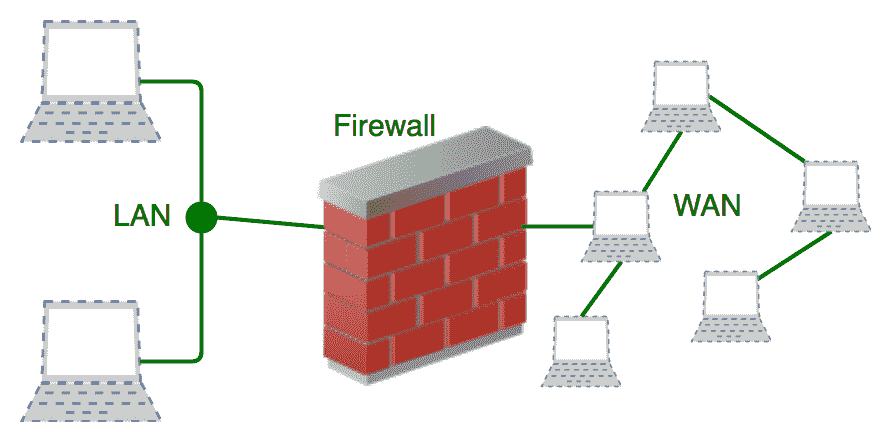
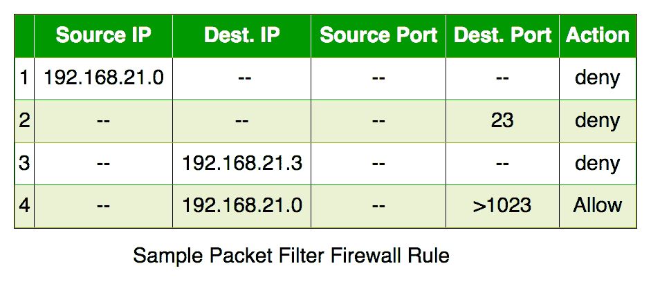

# 计算机网络防火墙介绍

> 原文：[https://www.geeksforgeeks.org/introduction-of-firewall-in-computer-network/](https://www.geeksforgeeks.org/introduction-of-firewall-in-computer-network/)

防火墙是一种基于硬件或软件的网络安全设备，它监控所有传入和传出的流量，并根据一组定义的安全规则接受、拒绝或丢弃该特定流量。

**接受**：允许流量
**拒绝**：阻塞流量但回复“无法到达错误”
**丢弃**：阻塞流量但不回复

防火墙在安全的内部网络和不受信任的外部网络（如互联网）之间建立了屏障。

## 防火墙的历史和需求

在防火墙之前，网络安全是由驻留在路由器上的访问控制列表来执行的。`ACL` 是决定是否应该授予或拒绝特定 `IP` 地址网络访问的规则。
但是 `ACL` 不能确定它所阻塞的数据包的性质。此外，单靠 `ACL` 无法将威胁阻挡在网络之外。因此，引入了防火墙。

对于组织来说，与互联网的连接不再是可选的。然而，访问互联网为组织带来好处；它还使外部世界能够与组织的内部网络互动。这给组织造成了威胁。为了保护内部网络免受未经授权的流量，我们需要一个防火墙。

## 防火墙如何工作

防火墙根据其表中定义的规则集匹配网络流量。匹配规则后，关联操作将应用于网络流量。例如，规则定义为人力资源部门的任何员工都不能从代码服务器访问数据，同时定义了另一个规则，如系统管理员可以从人力资源和技术部门访问数据。可以根据组织的必要性和安全策略在防火墙上定义规则。
从服务器的角度来看，网络流量可以是传出的，也可以是传入的。防火墙为这两种情况维护一组不同的规则。大多数来自服务器本身的输出流量被允许通过。尽管如此，为传出流量设置一个规则总是更好，以实现更高的安全性并防止不必要的通信。
入局流量区别对待。到达防火墙的大部分流量是这三种主要传输层协议之一——`TCP`、`UDP` 或 `ICMP`。所有这些类型都有源地址和目的地址。另外，`TCP` 和 `UDP` 都有端口号。`ICMP` 使用*类型代码*而不是端口号来识别数据包的目的。

**默认策略**：很难明确覆盖防火墙上所有可能的规则。因此，防火墙必须始终具有默认策略。默认策略仅包含操作（接受、拒绝或放弃）。
假设防火墙上没有定义 `SSH` 连接服务器的规则。所以，它将遵循默认策略。如果防火墙上的默认策略设置为*接受*，那么您办公室之外的任何计算机都可以建立到服务器的 `SSH` 连接。因此，将默认策略设置为*放弃*（或拒绝）始终是一种好的做法。

## 防火墙的产生

防火墙可以根据其生成进行分类。

1.  **第一代 - 包过滤防火墙**：包过滤防火墙用于通过监控出站和入站数据包，并根据源和目标 `IP` 地址、协议和端口允许或阻止它们来控制网络访问。它在传输协议层分析流量（但主要使用前3层）。
    包过滤防火墙将每个数据包视为独立个体。它们无法判断一个数据包是否属于现有流量流的一部分。它只能根据唯一的数据包头来允许或拒绝数据包。

包过滤防火墙维护一个过滤表，决定数据包是被转发还是被丢弃。从给定的过滤表中，将根据以下规则过滤数据包：
    

    1.  来自网络 `192.168.21.0` 的传入数据包被阻止。
    2.  发往内部 `TELNET` 服务器（端口 `23`）的传入数据包被阻止。
    3.  发往主机 `192.168.21.3` 的传入数据包被阻止。
    4.  允许向网络 `192.168.21.0` 提供所有众所周知的服务。

2.  **第二代 - 状态检测防火墙**：状态防火墙（执行状态数据包检测）能够确定数据包的连接状态，这与包过滤防火墙不同，包过滤防火墙使其效率更高。它跟踪通过它的网络连接的状态，例如 `TCP` 流。因此，过滤决策不仅基于定义的规则，还基于数据包在状态表中的历史。

3.  **第三代 - 应用层防火墙**：应用层防火墙可以检查和过滤任何 `OSI` 层上的数据包，最高可达应用层。它能够阻止特定内容，也能识别某些应用程序和协议（如 `HTTP`、`FTP`）何时被滥用。
    换句话说，应用层防火墙是运行代理服务器的主机。代理防火墙阻止防火墙两侧的直接连接，每个数据包都必须通过代理。它可以根据预定义的规则允许或阻止流量。

*注意：应用层防火墙也可以作为网络地址转换器（`NAT`）。*

4.  **下一代防火墙（`NGFW`）**：最近正在部署下一代防火墙，以阻止高级恶意软件攻击和应用层攻击等现代安全漏洞。`NGFW` 由深度数据包检测、应用程序检测、`SSL/SSH` 检测和许多保护网络免受这些现代威胁的功能组成。

## 防火墙类型

防火墙一般有两种类型：*基于主机的*和*基于网络的*。

1.  **基于主机的防火墙**：基于主机的防火墙安装在控制每个传入和传出数据包的每个网络节点上。它是一个软件应用程序或一套应用程序，作为操作系统的一部分。需要基于主机的防火墙，因为网络防火墙不能在可信网络中提供保护。主机防火墙保护每台主机免受攻击和未经授权的访问。
2.  **基于网络的防火墙**：网络防火墙在网络层面发挥作用。换句话说，这些防火墙过滤网络上的所有传入和传出流量。它通过使用防火墙上定义的规则过滤流量来保护内部网络。网络防火墙可能有两个或多个网络接口卡。基于网络的防火墙通常是安装了专有软件的专用系统。

两种类型的防火墙都有各自的优势。

## 参考文献

- [https://en.wikipedia.org/wiki/Firewall_(computing)](https://en.wikipedia.org/wiki/Firewall_(computing))
- [https://www.cisco.com/c/en_in/products/security/firewalls/what-is-a-firewall.html](https://www.cisco.com/c/en_in/products/security/firewalls/what-is-a-firewall.html)
- [http://nptel.ac.in/courses/106105084/31](http://nptel.ac.in/courses/106105084/31)

本文由 **Abhishek Agrawal** 供稿。如果你发现任何不正确的地方，或者你想分享更多关于上面讨论的话题的信息，请写评论。