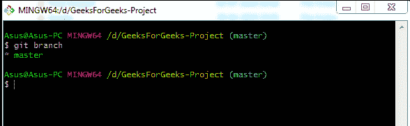
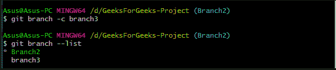

# Git 分支介绍

> 原文: [https://www.geeksforgeeks.org/introduction-to-git-branch/](https://www.geeksforgeeks.org/introduction-to-git-branch/)

分支意味着脱离主线，继续独立工作，不干扰主线。几乎每个 `VCS` 都有某种形式的分支支持。在 `Git` 中，分支仅仅是对提交的引用，下面的提交将被附加到其中。

## Git vs SVN

近年来，`Git` 的使用量大幅上升。与 `SVN` 不同，`git` 允许用户创建自己的存储库副本。`git` 成功的主要原因之一是它的速度。由于所有文件都存储在开发人员的本地计算机上，因此即使互联网连接非常差，他/她也可以访问所有文件。在其他 `VCS` 中，分支在时间和磁盘空间上都是一项昂贵的操作。

## Git vs Other VCS

`Git` 的分支特性是它区别于其他 `VCS` 工具的地方。`Git` 分支操作几乎是瞬时的，使得来回切换到分支的流程非常流畅。以下是 `git` 优于其他 `VCS` 的几个优点:
*   高运行速度
*   可用树的完整历史记录
*   分支运营
*   分类分布式模型

## 分支

当您提交时，`Git` 会存储一个提交对象，该对象包含指向您转移的内容的快照的指针。该对象还包含作者的姓名和电子邮件地址、您键入的消息、初始提交的零父项、正常提交的一个父项以及两个或多个分支合并后的提交的多个父项。前面讨论的分支是一个单独的开发线，因为 `git` 将分支存储为提交的引用。

**注意:** `Git` 分支用于列出、创建或删除分支，逻辑上划分你的工作比拥有大而结实的分支更容易。

## Git Branch-Options

| 选项 | 描述 |
| --- | --- |
| `-a` 或 `--all` | 此选项列出远程跟踪分支和本地分支。 |
| `git branch` 或 `git branch --list` | 活动列表模式或简单的 `git branch` 列出存储库的所有分支。 |
| `-c` 或 `--copy` | 此选项用于复制分支。 |
| `-C` | `--copy` `--force` 的快捷方式。 |
| `-d` 或 `--delete` | 此选项删除指定的分支。该分支必须与其上游分支完全合并。 |
| `-D` | `--delete` `--force` 的快捷方式。它删除分支，即使它有未合并的更改。 |
| `-m` 或 `--move` | 此选项移动/重命名分支。 |
| `-M` | `--move` `--force` 的快捷方式。 |
| `-q` 或 `--quiet` | 此选项抑制非错误消息。 |
| `-r` 或 `--remote` | 此选项用于列出所有远程跟踪分支。如果与 `-d` 一起使用，也可用于删除远程分支。 |
| `-t` 或 `--track` | 创建新分支时，它设置一个配置来标记起始分支。 |
| `--no-track` | 它不设置分支的“上游”配置。 |
| `--edit-description` | 它编辑分支的使用描述。 |
| `--contains` | 显示包含指定提交的分支列表。 |
| `git branch <mybranch>` | 创建一个新分支 `[mybranch]`。 |
| `git checkout -b <mybranch>` | 创建一个新分支 `[mybranch]` 并切换到它。 |

*   **Git 分支列出项目 ie 的唯一分支。主分支**

*   **更名主分支**

*   **复制“分支 2”并创建“分支 3”**

*   **删除“分支 3”**

## 总结

在本文中，我们讨论了高运行速度和分支行为。我们了解了 `git branch` 命令，它的主要功能是列出、创建和删除分支。我们还了解了各种 `git branch` 选项，以完全实现该命令的功能。