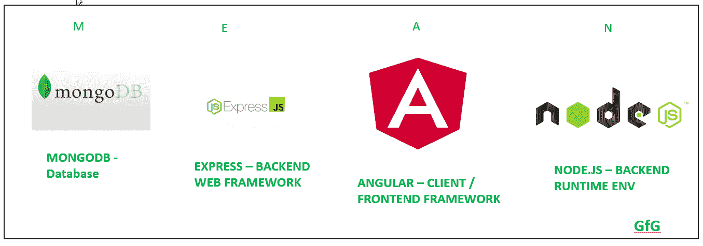
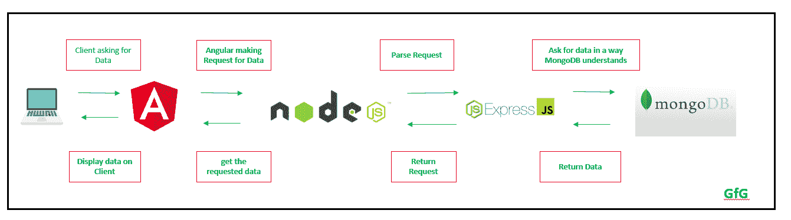
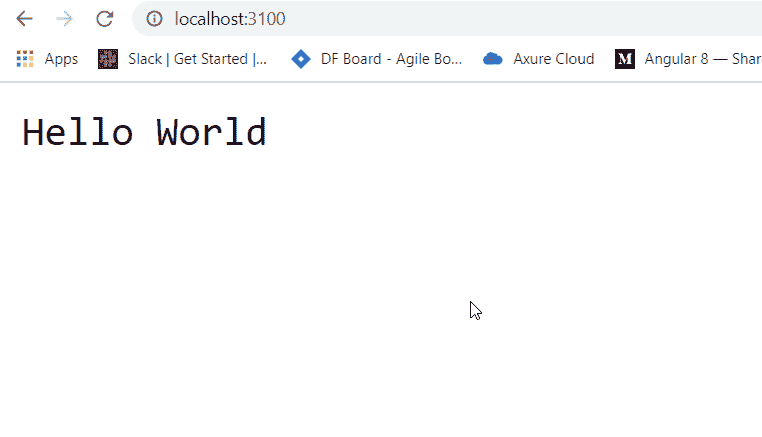
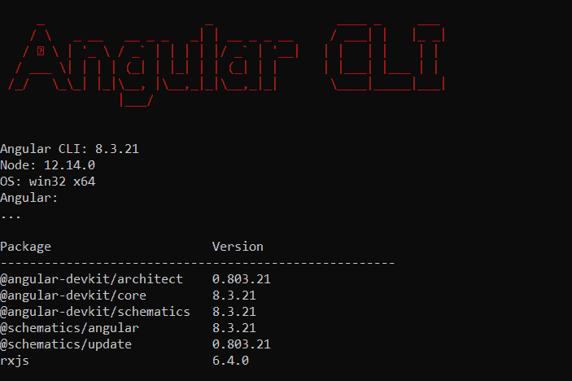
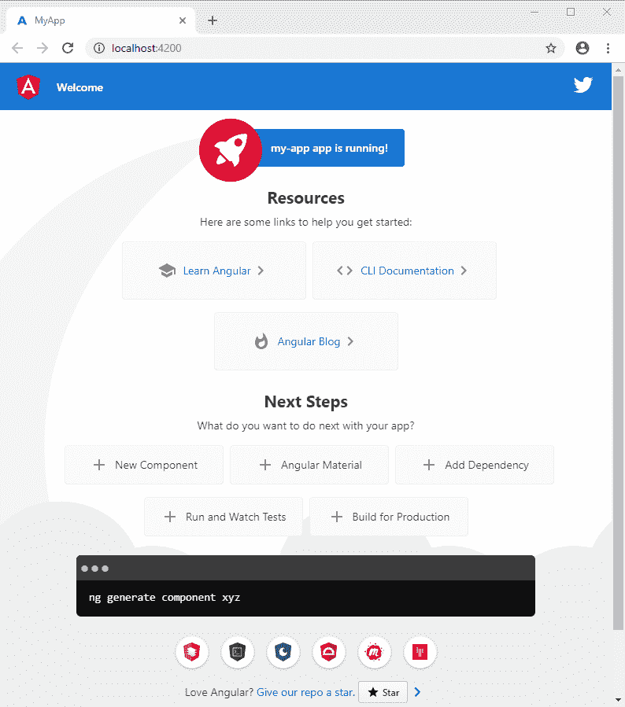
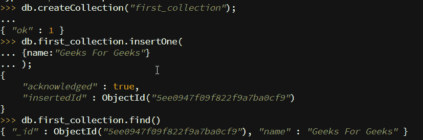
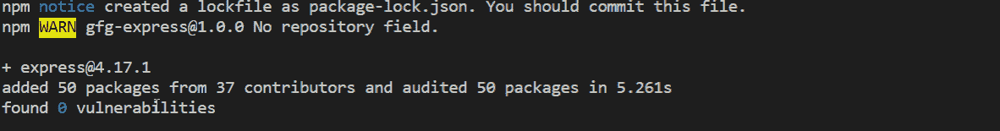
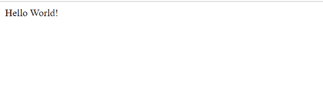

# MEAN Stack介绍

> 原文: [https://www.geeksforgeeks.org/introduction-to-mean-stack/](https://www.geeksforgeeks.org/introduction-to-mean-stack/)

MEAN Stack是最流行的技术栈之一。它用于开发全栈网络应用程序。虽然它是不同技术的堆栈，但所有这些都基于JavaScript语言。

MEAN代表:

1.  **M** – MongoDB
2.  **E** – Express
3.  **A** – Angular
4.  **N** – Node.js

这种堆栈导致更快的开发以及网络应用程序的部署。Angular是前端开发框架，而Node.js、Express和MongoDB用于后端开发，如下图所示。



**MEAN Stack应用程序中的数据流:** 这里，每个模块都与其他模块通信，以便有一个从服务器/后端到客户端/前端的数据流。



## 通过示例开始每项技术

下面给出了该堆栈中每项技术的描述以及学习它们的链接:

### 1. Node.js

Node.js用于用Javascript编写服务器端代码。最重要的一点是它在浏览器之外运行JavaScript代码。它是跨平台和开源的。

*   学习Node.js的先决条件
*   转到 [Node.js下载](https://nodejs.org/en/download/)，点击下载按钮，获取最新版本，并根据您的操作系统进行安装。
*   通过检查版本来验证是否正确安装:

```bash
node -v
```

如果没有获得版本，则说明安装不正确。

*   检查`npm`版本(默认与Node一起安装):

```bash
npm -v
```

*   在项目文件夹中创建一个`index.js`文件，并复制以下代码:

```javascript
var http = require("http");

http.createServer(function (request, response) {
    response.writeHead(200, {'Content-Type': 'text/plain'});
    // Send the response text as "Hello World"
    response.end('Hello World\n');
}).listen(3100);

console.log('Server running at http://127.0.0.1:3100/');
```

*   现在打开终端，执行以下命令:

```bash
node index.js
```

*   您将在终端控制台上看到一个日志，上面写着:

```text
Server running at http://127.0.0.1:3100/
```

*   进入浏览器，输入网址: `http://127.0.0.1:3100/` 会看到如下输出:
    
*   了解更多关于Node.js:
    1.  [Node.js简介](https://www.geeksforgeeks.org/introduction-to-nodejs/)
    2.  [Node.js教程](https://www.geeksforgeeks.org/nodejs-tutorials/)
    3.  [了解Node.js最新版本](https://nodejs.org/en/docs/)

### 2. AngularJS

Angular是谷歌团队开发的前端开源框架。这个框架以保持向后兼容性的方式进行了修改(如果有任何重大变化，Angular会很早通知它)。使用Angular团队开发的Angular CLI(命令行界面)工具创建Angular项目非常简单。

*   学习Angular的先决条件:
    1.  TypeScript
    2.  CSS预处理器
    3.  模板代码(Angular Material, HTML 5等)
*   使用`npm`(Node包管理器)安装Angular CLI–命令行界面

```bash
npm install -g @angular/cli
```

*   现在使用以下命令检查是否正确安装:

```bash
ng --version
```

它应该显示类似于:
    

*   现在，使用以下命令创建一个新项目:

```bash
ng new project_name
```

*   使用以下命令进入项目目录:

```bash
cd project_name
```

*   使用以下命令启动Angular应用:

```bash
ng serve
```

*   应用将在 `http://localhost:4200` 上启动，你会看到如下:
    
*   现在在`app.component.html`文件中进行更改并保存文件，应用程序将自动重新加载，相应的更改将会反映出来。
*   相关Angular文章链接:
    1.  [AngularJS简介](https://www.geeksforgeeks.org/introduction-to-angularjs/)
    2.  [Angular 7简介](https://www.geeksforgeeks.org/angular-7-introduction/)
    3.  [Angular 7安装](https://www.geeksforgeeks.org/angular-7-installation/?ref=rp)
    4.  [Angular 7数据服务和Observable](https://www.geeksforgeeks.org/angular-7-angular-data-services-using-observable/)
    5.  [Angular 7简单易用App](https://www.geeksforgeeks.org/how-to-create-todo-list-in-angular-7/)
    6.  [了解最新发布的Angular](https://angular.io/docs)

### 3. MongoDB

MongoDB是一个NoSQL数据库。它有类似JSON的文档。它是面向文档的数据库。

*   学习MongoDB的先决条件:
    1.  什么是数据库
    2.  数据库的缺点
*   创建数据库:

```javascript
use database_name;
```

*   创建集合:

```javascript
db.createCollection("first_collection");
```

*   在集合中插入记录:

```javascript
db.first_collection.insertOne(
    {name:"Geeks For Geeks"}
);
```

*   打印集合中的所有记录:

```javascript
db.first_collection.find()
```



*   关于MongoDB的链接:
    1.  [MongoDB简介](https://www.geeksforgeeks.org/mongodb-an-introduction/)
    2.  [MongoDB入门](https://www.geeksforgeeks.org/mongodb-getting-started/)
    3.  [定义、创建和删除MongoDB集合](https://www.geeksforgeeks.org/defining-creating-and-dropping-a-mongodb-collection/)
    4.  [MongoDB是如何工作的？](https://www.geeksforgeeks.org/how-mongodb-works/?ref=rp)
    5.  [了解最新版本的MongoDB](https://docs.mongodb.com/)

### 4. ExpressJS

Express是一个基于Node.js构建的web框架，用于制作API和构建Web应用程序。

*   学习Express的先决条件:
    1.  JavaScript/ TypeScript
    2.  Node.js
*   通过在终端上键入以下命令来初始化项目:

```bash
npm init
```

*   它会问一些问题，按回车键以设置所有默认选项。这将创建如下所示的`package.json`文件:

```json
{
  "name": "gfg-express",
  "version": "1.0.0",
  "description": "Basic Express Node.js Application",
  "main": "index.js",
  "scripts": {
    "test": "echo \"Error: no test specified\" && exit 1"
  },
  "author": "",
  "license": "ISC",
}
```

*   使用以下命令安装Express:

```bash
npm install express --save
```



*   现在，`package.json`文件将被更改以添加依赖项，如下所示:

```json
{
  "name": "gfg-express",
  "version": "1.0.0",
  "description": "Basic Express Node.js Application",
  "main": "index.js",
  "scripts": {
    "test": "echo \"Error: no test specified\" && exit 1"
  },
  "author": "",
  "license": "ISC",
  "dependencies": {
    "express": "^4.17.1"
  }
}
```

*   创建`index.js`文件并添加下面的代码:

```javascript
const express = require('express')
const app = express()
const PORT = 3000

app.get('/', (req, res) => 
    res.send('Hello World!'))

app.listen(PORT, () => console.log(
    `Example app listening at http://localhost:${PORT}`))
```

*   使用以下命令启动Express服务器:

```bash
node index.js
```

*   转到 `http://localhost:3000` 看到如下输出:
    
*   学习ExpressJS的链接:
    1.  [Express简介](https://www.geeksforgeeks.org/introduction-to-express/)
    2.  [使用Express设计第一个应用](https://www.geeksforgeeks.org/design-first-app-using-express/)