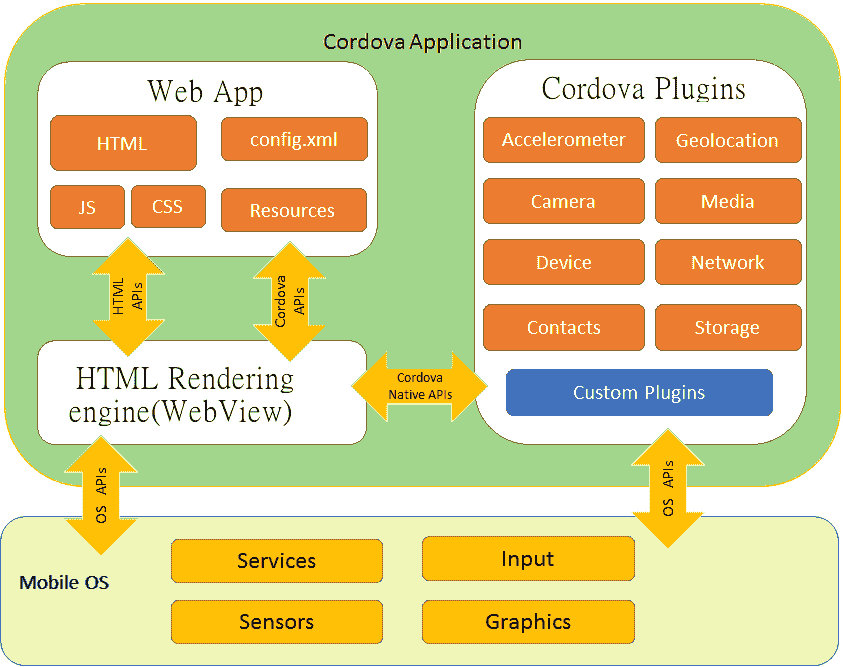
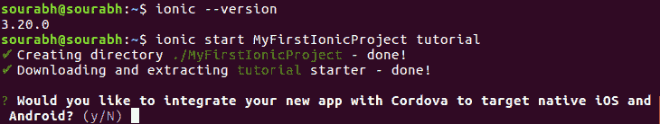
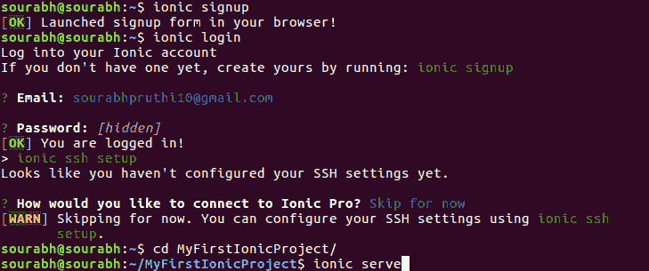
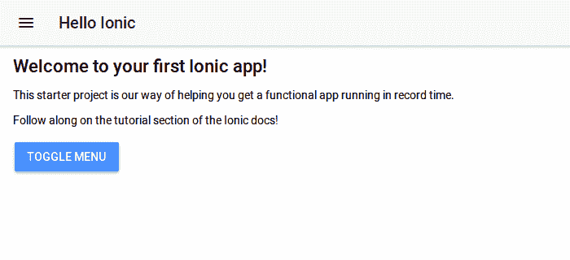

# 离子框架:现代网络应用背后的力量

> 原文: [https://www.geeksforgeeks.org/ionic-framework-the-power-behind-modern-web-apps/](https://www.geeksforgeeks.org/ionic-framework-the-power-behind-modern-web-apps/)

在这篇文章中，我们将接触到离子框架。正如标题中所建议的，很明显，它将用于创建强大的网络应用程序，并部署到作为安卓或 iOS 的本地环境中。

没有必要学习任何安卓、swift 或 objective C(早期用于创建 iOS 应用程序)来创建应用程序，也就是说，如果你不知道这些技术中的任何一项，但仍然想创建令人惊叹的应用程序，并希望你的名字发布在 play store 或 iStore 上，那么这是一个很好的方法。这样做的前提是，如果你熟悉 HTML、CSS 和 JavaScript，那么你就可以开始了。如果你知道 Angular，那当然是一个加分点。

现在，一些人可能会想到的基本问题是，一个用网络技术设计的应用程序如何能够在安卓或 iOS 等本地环境中运行。这个问题由 Apache Cordova(也称为 PhoneGap)回答。它是移动应用程序开发框架，或者简单地说，它用于部署网络应用程序，使它们适合我们希望作为最终产品的本地环境。

下图示例清晰显示了科尔多瓦的工作情况

更多详情请阅读[这里](https://cordova.apache.org/)

## 创建你的第一个离子应用的步骤

1.  **下载并安装离子框架：** 第一步是在你的系统上下载并安装离子框架。这里要明确，由于 `ionic` 是一个 `npm` 模块，因此它只能通过 `npm`（即 `node` 包管理器）来安装。换句话说，你的系统上必须已经安装了 `nodejs`。从[这里](https://nodejs.org/en/download/)下载 `nodejs`。我建议安装 LTS 版本，因为它更稳定。安装 `nodejs` 后，你就可以安装 `ionic` 了，因为 `npm` 会自动安装。下面我将展示安装过程。
    我使用的是 `ubuntu`，但如果你用的是 `Windows`，别担心，我也会指导 `Windows` 用户 :)。对于 `Linux` 用户，在安装 `ionic` 之前，请在终端中输入以下命令来更新软件源。`Windows` 用户不需要做任何事情。

    ```bash
    sudo apt-get update
    ```

    然后使用不同于 `Linux` 或 `Windows` 的命令安装 `ionic`。对于 `Linux` 用户

    ```bash
    sudo apt-get -g install ionic
    ```

    由于是全局安装，所以需要编写 `-g` 和 `sudo`。
    对于 `Windows` 用户，请按照下面的命令操作。您可能需要以管理员身份运行命令提示符。

    ```bash
    npm install ionic
    ```

2.  **安装后运行以下命令：**

    ```bash
    ionic --version
    ```

    这基本上是为了测试 `ionic` 是否已经成功安装在你的系统上。
    下一步是使用以下命令创建你的 `ionic` 应用。

    ```bash
    ionic start name_of_project template_name
    ```

    该命令是要遵循的基本语法。对于 `Windows` 和 `Linux` 用户来说都是一样的。下图清晰地描绘了这个过程:
    
    下面我来解释一下上面的命令。`ionic start` 基本上告诉创建一个新的 `ionic` app，接下来是 app 的名称，然后是 `starter` 模板。根据需要，`ionic` 还提供各种其他模板，如 `tabs`、`sidemenu`、`blank` 等。这是应用程序的基本布局，将被进一步构建。运行该命令后，它还会询问您是否想要将该应用程序与 `cordova` 集成，您只需键入 `yes` 即可。

3.  **项目目录：** 最后一步是通过输入以下命令进入项目目录

    ```bash
    cd project_name
    ```

    
    你也可以通过注册进入 `ionic` 官网安装 `ionic pro sdk` 享受酷炫的环境。您也可以设置 `SSH`，或者如果您不想使用，现在可以跳过。接下来键入以下命令

    ```bash
    ionic serve
    ```

    瞧啊！您已经创建了第一个应用程序。
    

## 离子框架的优缺点

**优点**简述如下:

*   **开发一次部署到任何地方**
*   由于它是在 `web` 技术之上构建的，所以在创建强大和健壮的应用程序时非常有用。
*   开发快，维护成本低

**也不要忽视**的劣势**。这些是:**

*   与原生应用相比，性能较差。(不要误解这里是比较)
*   复杂应用的高技能要求
*   内置导航可能复杂