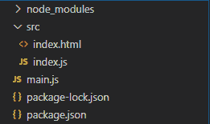
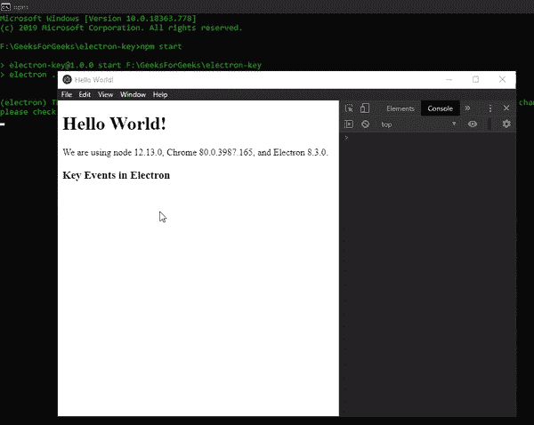

# Electron 中的键盘事件

> 原文: [https://www.geeksforgeeks.org/keyboard-events-in-electronjs/](https://www.geeksforgeeks.org/keyboard-events-in-electronjs/)

[`electronjs`](https://www.geeksforgeeks.org/introduction-to-electronjs/) 是一个开源框架，用于使用能够在 [`Windows`](https://www.geeksforgeeks.org/introduction-to-electronjs/)、[`macOS`](https://www.geeksforgeeks.org/introduction-to-electronjs/) 和 [`Linux`](https://www.geeksforgeeks.org/introduction-to-electronjs/) 操作系统上运行的 HTML、CSS 和 JavaScript 等 web 技术构建跨平台原生桌面应用。它将 Chromium 引擎和 [`NodeJS`](https://www.geeksforgeeks.org/introduction-to-nodejs/) 结合成一个单一的运行时。

在 web 开发中，[`jQuery`](https://www.geeksforgeeks.org/jquery-tutorials/) [`键盘事件`](https://api.jquery.com/category/events/keyboard-events/) 提供了一种便捷的方式，通过这种方式我们可以按顺序记录键盘的按键。这些事件包括组合键、特殊键和修饰符，一旦键按下并释放，就会触发。这些事件非常重要，以防我们想要跟踪或触发某些按键的某些功能。除了提供 [`加速器`](https://www.electronjs.org/docs/api/accelerator) 和 [`全局快捷方式`](https://www.electronjs.org/docs/api/global-shortcut) 模块之外，Electron 还为我们提供了一种方法，通过该方法，我们可以使用内置 [`浏览器窗口`](https://www.geeksforgeeks.org/introduction-to-electronjs/) 对象的实例方法和事件以及 [`网络内容`](https://www.geeksforgeeks.org/introduction-to-electronjs/) 属性来记录键盘事件。本教程将演示 Electron 键盘事件。

我们假设您熟悉上述链接中介绍的先决条件。Electron 要工作，[`节点`](https://www.geeksforgeeks.org/introduction-to-nodejs/) 和 [`npm`](https://www.geeksforgeeks.org/node-js-npm-node-package-manager/) 需要预装在系统中。

*   **项目结构:**



**示例:** 按照 [`如何在 Electron 中查找页面上的文本`](https://www.geeksforgeeks.org/how-to-find-text-on-page-in-electronjs/) 中给出的步骤设置基本的 Electron 应用程序。复制文章中提供的 [`main.js`](https://www.geeksforgeeks.org/how-to-find-text-on-page-in-electronjs/) 文件和 [`index.html`](https://www.geeksforgeeks.org/how-to-find-text-on-page-in-electronjs/) 文件的样板代码。还要对 [`package.json`](https://www.geeksforgeeks.org/how-to-find-text-on-page-in-electronjs/) 文件进行必要的更改，以启动 Electron 应用程序。我们将继续使用相同的代码库构建我们的应用程序。设置 Electron 应用程序所需的基本步骤保持不变。

**package.json:**

```json
{
  "name": "electron-key",
  "version": "1.0.0",
  "description": "Key events in Electron",
  "main": "main.js",
  "scripts": {
    "start": "electron ."
  },
  "keywords": [
    "electron"
  ],
  "author": "Radhesh Khanna",
  "license": "ISC",
  "dependencies": {
    "electron": "^8.3.0"
  }
}
```

**输出:** 此时，我们的基本 Electron 应用程序设置完毕。启动应用程序后，我们应该会看到以下结果。

[](https://media.geeksforgeeks.org/wp-content/uploads/20200512225834/Output-1105.png)

**Electron 中的键盘事件:** [`浏览器窗口`](https://www.geeksforgeeks.org/introduction-to-electronjs/) 实例和 [`网站内容`](https://www.geeksforgeeks.org/introduction-to-electronjs/) 属性是 [`主进程`](https://www.geeksforgeeks.org/introduction-to-electronjs/) 的一部分。要在 [`渲染器进程`](https://www.geeksforgeeks.org/introduction-to-electronjs/) 中导入和使用浏览器窗口，我们将使用 Electron [`远程`](https://www.geeksforgeeks.org/introduction-to-electronjs/) 模块。

**index.html:** 在该文件中添加以下片段。

```html
<h3>Key Events in Electron</h3>
```

**index.js:** 在该文件中添加以下代码片段。

```javascript
const electron = require("electron");

// Importing BrowserWindow from Main Process 
// using Electron remote
const BrowserWindow = electron.remote.BrowserWindow;
const win = BrowserWindow.getFocusedWindow();

// let win = BrowserWindow.getAllWindows()[0];

win.webContents.on("before-input-event", (event, input) => {
    console.log(input);
});
```

[`网络内容`](https://www.geeksforgeeks.org/introduction-to-electronjs/) 属性的 [`before-input-event`](https://www.electronjs.org/docs/api/web-contents#event-before-input-event) 与 [`键盘事件`](https://developer.mozilla.org/en-US/docs/Web/API/KeyboardEvent) Web API 紧密配合。[`键盘事件`](https://developer.mozilla.org/en-US/docs/Web/API/KeyboardEvent) 描述了用户与键盘的交互。它继承了 [`UIEvent`](https://developer.mozilla.org/en-US/docs/Web/API/UIEvent) 和全局 [`Event`](https://developer.mozilla.org/en-US/docs/Web/API/Event) 对象的实例方法和属性。在网页中，[`键盘事件`](https://developer.mozilla.org/en-US/docs/Web/API/KeyboardEvent) 的 [`keydown`](https://developer.mozilla.org/en-US/docs/Web/API/KeyboardEvent/keydown_event) 和 [`keyup`](https://developer.mozilla.org/en-US/docs/Web/API/KeyboardEvent/keyup_event) 事件发出前，[`before-input-event`](https://www.electronjs.org/docs/api/web-contents#event-before-input-event) 实例事件被触发。此实例事件利用了 [`键盘事件`](https://developer.mozilla.org/en-US/docs/Web/API/KeyboardEvent) 对象的构造函数。它返回以下参数。

*   **event:** 全局 [`Event`](https://developer.mozilla.org/en-US/docs/Web/API/Event) 对象。
*   **input:** 对象，包含以下参数。
    *   **type:** 字符串，该参数定义已经发生的 [`键盘事件`](https://developer.mozilla.org/en-US/docs/Web/API/KeyboardEvent) 的类型。数值可以是 `keyup` 或 `keydown`。[`before-input-event`](https://www.electronjs.org/docs/api/web-contents#event-before-input-event) 事件不支持 `keypress` 事件，因为它已经被 [`键盘事件`](https://developer.mozilla.org/en-US/docs/Web/API/KeyboardEvent) Web API 本身否决了。
    *   **key:** 字符串，该参数相当于 [`KeyboardEvent.key`](https://developer.mozilla.org/en-US/docs/Web/API/KeyboardEvent/key) 参数。这是一个只读属性。该值返回一个 [`DOMString`](https://developer.mozilla.org/en-US/docs/Web/API/DOMString)，代表所按键的键值。
    *   **code:** 字符串，该参数相当于 [`KeyboardEvent.code`](https://developer.mozilla.org/en-US/docs/Web/API/KeyboardEvent/code) 参数。这是一个只读属性。该值返回一个按下键的代码值的 [`DOMString`](https://developer.mozilla.org/en-US/docs/Web/API/DOMString)。
    *   **isAutoRepeat:** 布尔型，该参数相当于 [`KeyboardEvent.repeat`](https://developer.mozilla.org/en-US/docs/Web/API/KeyboardEvent/repeat) 参数。这是一个只读属性。如果按键被长时间按下，使其自动重复，则该值返回 `true`。默认值为 `false`。
    *   **shift:** 布尔值，该参数相当于 [`KeyboardEvent.shiftKey`](https://developer.mozilla.org/en-US/docs/Web/API/KeyboardEvent/shiftKey) 参数。这是一个只读属性。如果按下 `Shift` 键时该键处于激活状态，则该值返回 `true`。
    *   **control:** 布尔型，该参数相当于 [`KeyboardEvent.ctrlKey`](https://developer.mozilla.org/en-US/docs/Web/API/KeyboardEvent/ctrlKey) 参数。这是一个只读属性。如果按下 `Ctrl` 键时该键有效，则该值返回 `true`。默认值为 `false`。
    *   **alt:** 布尔型，该参数相当于 [`KeyboardEvent.altKey`](https://developer.mozilla.org/en-US/docs/Web/API/KeyboardEvent/altKey) 参数。这是一个只读属性。如果按下 `Windows` 和 `Linux` 上的 `Alt` 键，该值返回 `true` (相当于 `macOS` 上的 `Option` 键)。默认值为 `false`。
    *   **meta:** 布尔型，该参数相当于 [`KeyboardEvent.metaKey`](https://developer.mozilla.org/en-US/docs/Web/API/KeyboardEvent/metaKey) 参数。这是一个只读属性。如果按下 `Windows` 和 `Linux` 上的 `Windows` 键激活(相当于 `macOS` 上的 `Command` 键)，则该值返回 `true`。默认值为 `false`。

要在 [`渲染器进程`](https://www.geeksforgeeks.org/introduction-to-electronjs/) 中获取当前 [`浏览器窗口`](https://www.geeksforgeeks.org/introduction-to-electronjs/) 实例，我们可以使用 [`浏览器窗口`](https://www.geeksforgeeks.org/introduction-to-electronjs/) 对象提供的一些静态方法。

*   **`BrowserWindow.getAllWindows()`:** 此方法返回一个活动/打开的 `BrowserWindow` 实例数组。在这个应用程序中，我们只有一个活动的 [`浏览器窗口`](https://www.geeksforgeeks.org/introduction-to-electronjs/) 实例，它可以直接从数组中引用，如代码所示。
*   **`BrowserWindow.getFocusedWindow()`:** 此方法返回在应用程序中聚焦的 [`浏览器窗口`](https://www.geeksforgeeks.org/introduction-to-electronjs/) 实例。如果没有找到当前浏览器窗口实例，则返回 `null`。在这个应用程序中，我们只有一个活动的 [`浏览器窗口`](https://www.geeksforgeeks.org/introduction-to-electronjs/) 实例，可以使用这个方法直接引用它，如代码所示。

**输出:** 此时，我们应该可以成功触发 Electron 中的键盘事件。

[](https://media.geeksforgeeks.org/wp-content/uploads/20200614134158/Output-1-GIF7.gif)