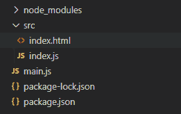
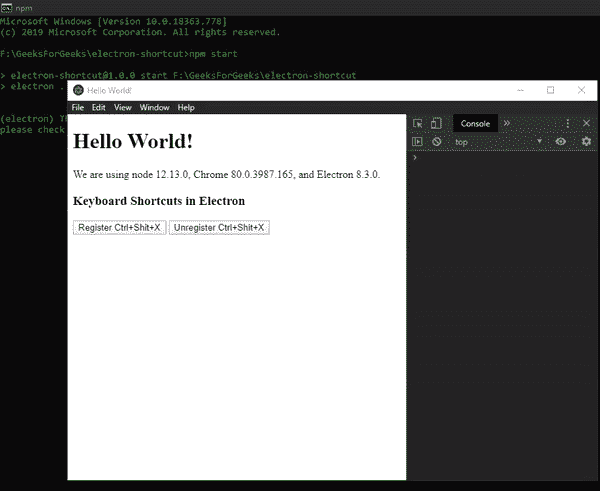

# Electron中的键盘快捷键

> 原文：[https://www.geeksforgeeks.org/keyboard-shortcuts-in-electronjs/](https://www.geeksforgeeks.org/keyboard-shortcuts-in-electronjs/)

[`Electron`](https://www.geeksforgeeks.org/introduction-to-electronjs/) 是一个开源框架，用于使用能够在 Windows、macOS 和 Linux 操作系统上运行的 HTML、CSS 和 JavaScript 等网络技术构建跨平台的本机桌面应用程序。它将 Chromium 引擎和 [`Node.js`](https://www.geeksforgeeks.org/introduction-to-nodejs/) 结合成一个单一的运行时。

使用键盘快捷键是一项高效省时的活动。习惯于使用键盘快捷键的用户比不习惯使用键盘快捷键的用户工作效率更高，处理多项任务的效率更高。键盘快捷键让你事半功倍。它们在同时管理电脑上的大量任务时非常有用。Electron 为我们提供了一种方法，通过这种方法，我们可以使用内置 [`globalShortcut`](https://www.electronjs.org/docs/latest/api/global-shortcut) 模块的实例方法在整个应用程序中定义全局快捷方式。本教程将演示如何在整个 Electron 应用程序中注册全局键盘快捷键。

我们假设您熟悉上述链接中介绍的先决条件。Electron 工作需要在系统中预装 [`Node.js`](https://www.geeksforgeeks.org/introduction-to-nodejs/) 和 [`npm`](https://www.geeksforgeeks.org/node-js-npm-node-package-manager/)。

## 项目结构



## Electron中的全局快捷键

[`globalShortcut`](https://www.electronjs.org/docs/latest/api/global-shortcut) 模块用于在应用程序没有键盘焦点时检测键盘事件，因为注册的事件是全局的。该模块是主进程的一部分。要导入并使用渲染器进程中的 `globalShortcut` 模块，我们将使用 Electron 的 [`remote`](https://www.electronjs.org/docs/latest/api/remote) 模块。`globalShortcut` 模块向本机系统操作系统注册/注销一个全局键盘快捷键，我们可以自定义这些快捷键来执行整个应用程序中的各种操作。该模块只能在 [`app`](https://www.electronjs.org/docs/latest/api/app) 模块的 `ready` 事件发出后使用，如 `main.js` 文件所示。`globalShortcut` 模块只支持实例方法。它没有任何关联的实例事件或属性。

## 示例

按照给定的步骤在 Electron 中实现全局快捷键。

### 第一步

按照 [在Electron中查找页面上的文本](https://www.geeksforgeeks.org/how-to-find-text-on-page-in-electronjs/) 中给出的步骤，设置基本的 Electron 应用程序。复制文章中提供的 `main.js` 文件和 `index.html` 文件的样板代码。还要对 `package.json` 文件进行必要的更改，以启动 Electron 应用程序。我们将继续使用相同的代码库构建我们的应用程序。设置 Electron 应用程序所需的基本步骤保持不变。

**package.json:**

```json
{
  "name": "electron-shortcut",
  "version": "1.0.0",
  "description": "Register Global Shortcuts in Electron",
  "main": "main.js",
  "scripts": {
    "start": "electron ."
  },
  "keywords": [
    "electron"
  ],
  "author": "Radhesh Khanna",
  "license": "ISC",
  "dependencies": {
    "electron": "^8.3.0"
  }
}
```

**输出：** 此时，我们的基本 Electron 应用程序设置完毕。启动应用程序后，我们应该会看到以下输出：

[](https://media.geeksforgeeks.org/wp-content/uploads/20200512225834/Output-1105.png)

### 第二步

在 `index.html` 和 `index.js` 文件中添加以下代码片段，用于在 Electron 中实现全局快捷键。

**index.html:** 在该文件中添加以下代码片段。

```html
<h3>Keyboard Shortcuts in Electron</h3>
<button id="register">
    Register Ctrl+Shift+X
</button>
<button id="unregister">
    Unregister Ctrl+Shift+X
</button>
```

“Register Ctrl+Shift+X” 和 “Unregister Ctrl+Shift+X” 按钮还没有任何相关功能。要进行更改，请在 `index.js` 文件中添加以下代码。

**index.js:** 在该文件中添加以下代码片段。

```javascript
const electron = require("electron");
const globalShortcut = electron.remote.globalShortcut;

var register = document.getElementById("register");
var unregister = document.getElementById("unregister");

register.addEventListener("click", (event) => {
    const check = globalShortcut.register("CommandOrControl+Shift+X", () => {
        console.log("CommandOrControl+Shift+X is pressed");
    });

    if (check) {
        console.log("Ctrl+Shift+X Registered Successfully");
    }

    globalShortcut.registerAll(["CommandOrControl+X", 
                                "CommandOrControl+Y"], () => {
        console.log("One Global Shortcut defined " + 
                    "in registerAll() method is Pressed.");
    });
});

unregister.addEventListener("click", (event) => {
    if (globalShortcut.isRegistered("CommandOrControl+Shift+X")) {
        globalShortcut.unregister("CommandOrControl+Shift+X");
        console.log("Ctrl+Shift+X unregistered Successfully");
    }

    globalShortcut.unregisterAll();
});
```

## 方法参考

### `globalShortcut.register(accelerator, callback)`

该方法为应用程序注册由 `accelerator` 定义的全局快捷方式。该方法返回一个布尔值，说明全局快捷方式是否注册成功。它接受以下参数。

*   **accelerator**: 字符串。`accelerator` 字符串如上定义。
*   **callback**: 函数。当用户按下注册的快捷方式时，调用该函数。

### `globalShortcut.registerAll(accelerators, callback)`

此方法的行为与 `globalShortcut.register()` 方法完全相同，只是它采用了 `accelerator` 的字符串数组，而不是单个字符串。此方法不返回任何值，因为我们无法检查字符串数组中的每个 `accelerator` 项目是否注册成功。当用户按下 `accelerator` 数组中任何一个已注册的快捷键时，将调用 `callback` 函数。

### `globalShortcut.isRegistered(accelerator)`

此方法用于检查应用程序是否注册了 `accelerator` 快捷键。它返回一个布尔值。它以 `accelerator` 字符串为参数进行检查。当 `accelerator` 已经被同时在系统操作系统上执行的另一个应用程序占用时，该调用将无声地返回 `false`。这种行为是由原生的系统操作系统定义的，因为它们不希望应用程序争夺全局快捷键。

### `globalShortcut.unregister(accelerator)`

该方法用于注销 `accelerator` 字符串参数定义的全局快捷方式。此方法没有任何返回类型。

### `globalShortcut.unregisterAll()`

此方法用于注销应用程序的所有全局快捷键。此方法没有任何返回类型。

**输出：**

[](https://media.geeksforgeeks.org/wp-content/uploads/20200606204555/Output-1-GIF2.gif)

## 注意事项

应用程序全局快捷键不同于 [`BrowserWindow`](https://www.electronjs.org/docs/latest/api/browser-window) 对象的键盘事件。有关 Electron 支持的键盘事件的详细说明，请参考 Electron 支持的 [键盘事件](https://www.electronjs.org/docs/latest/api/keyboard-events) 一文。键盘事件使用 `BrowserWindow` 对象的不同实例事件来读取和注册键盘上的按键。它们可用于在 `BrowserWindow` 实例中定义快捷方式。`before-input-event` 实例事件在页面中调度 `keydown` 和 `keyup` 事件之前发出。可以在 `BrowserWindow` 实例中捕捉和处理自定义快捷方式，文中也有相关说明。

如果我们不想在 ElectronJS 中进行手动快捷方式解析，可以使用像 [Mousetrap](https://github.com/ccampbell/mousetrap) 这样的外部库，在 JavaScript 中进行高级的键检测。Mousetrap 是一个轻量级的简单库，用于处理 JavaScript 中的键盘快捷键，并为 Chromium 浏览器提供了广泛的支持。该库还支持特定组合键和序列的 `BrowserWindow` 对象的 `keyup` 和 `keydown` 实例事件。它也不需要调度 `before-input-event` 实例事件，也不需要外部依赖。它还可以与键盘上的数字小键盘配合使用，并且可以直接绑定到特殊字符，例如 `?` 和 `*` 而不必指定任何附加修饰符，如 `Shift` 或 `/` 因为它们在不同的键盘上不一致。

**注意：** `keypress` 实例事件不被 Electron 支持，因为它已经被键盘事件 Web API 本身否决了，但是 Mousetrap 仍然支持它。