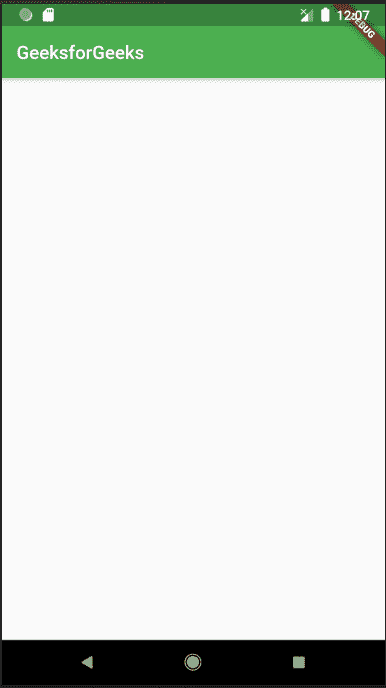

# MaterialApp 类

> 原文: [https://www.geeksforgeeks.org/materialapp-class-in-flutter/](https://www.geeksforgeeks.org/materialapp-class-in-flutter/)

`MaterialApp` 是 Flutter 中的预定义类。它可能是 Flutter 的主要或核心部件。我们可以访问 Flutter SDK 提供的所有其他组件和小部件。文本小部件、下拉按钮小部件、[应用栏](https://www.geeksforgeeks.org/flutter-appbar-widget/)小部件、[脚手架](https://www.geeksforgeeks.org/scaffold-class-in-flutter-with-examples/)小部件、[列表视图](https://www.geeksforgeeks.org/listview-class-in-flutter/)小部件、[状态小部件](https://www.geeksforgeeks.org/flutter-stateful-vs-stateless-widgets/)、[状态小部件](https://www.geeksforgeeks.org/difference-between-stateless-and-stateful-widget-in-flutter/)、图标按钮小部件、文本字段小部件、填充小部件、主题数据小部件等，都是可以使用 `MaterialApp` 类访问的小部件。有更多的小部件可以使用 `MaterialApp` 类来访问。使用这个小部件，我们可以制作一个有吸引力的应用程序。

这里有一个用 `dart` 语言编写的非常简单的代码，用来制作一个标题为 `GeeksforGeeks` 的 [appBar](https://www.geeksforgeeks.org/flutter-appbar-widget/) 屏幕。

## 构造函数

```html
const MaterialApp(
{Key key,
GlobalKey<NavigatorState> navigatorKey,
Widget home,
Map<String, WidgetBuilder> routes: const <String, WidgetBuilder>{},
String initialRoute,
RouteFactory onGenerateRoute,
InitialRouteListFactory onGenerateInitialRoutes,
RouteFactory onUnknownRoute,
List<NavigatorObserver> navigatorObservers: const <NavigatorObserver>[],
TransitionBuilder builder,
String title: '',
GenerateAppTitle onGenerateTitle,
Color color,
ThemeData theme,
ThemeData darkTheme,
ThemeData highContrastTheme,
ThemeData highContrastDarkTheme,
ThemeMode themeMode: ThemeMode.system,
Locale locale,
Iterable<LocalizationsDelegate> localizationsDelegates,
LocaleListResolutionCallback localeListResolutionCallback,
LocaleResolutionCallback localeResolutionCallback,
Iterable<Locale> supportedLocales: const <Locale>[Locale('en', 'US')],
bool debugShowMaterialGrid: false,
bool showPerformanceOverlay: false,
bool checkerboardRasterCacheImages: false,
bool checkerboardOffscreenLayers: false,
bool showSemanticsDebugger: false,
bool debugShowCheckedModeBanner: true,
Map<LogicalKeySet, Intent> shortcuts,
Map<Type, Action<Intent>> actions}
)
```

## 属性

*   `actions`: 该属性取 `Map<Type, Action<Intent>>` 为对象。它控制意图键。
*   `backButtonDispatcher`: 决定如何处理后退按钮。
*   `checkerboardRasterCacheImages`: 该属性接受一个布尔值作为对象。如果设置为 `true`，它将打开光栅缓存图像的棋盘。
*   `color`: 控制应用中使用的原色。
*   `darkTheme`: 为应用提供黑暗主题的 `ThemeData`。
*   `debugShowCheckedModeBanner`: 这个属性接受一个布尔值作为对象来决定是否显示调试 banner。
*   `debugShowMaterialGrid`: 该属性以布尔值为对象。如果设置为 `true`，它会绘制一个基线网格材质应用程序。
*   `highContrastTheme`: 它提供了用于高对比度主题的 `ThemeData`。
*   `home`: 该属性取 `Widget` 为对象，在 app 默认路线上显示。
*   `initialRoute`: 该属性采用一个字符串作为对象，给出构建导航器的第一条路线的名称。
*   `locale`: 它为 `MaterialApp` 提供了一个区域设置。
*   `localizationsDelegate`: 这为区域设置提供了一个委托。
*   `navigatorKey`: 在构建导航器时，它以 `GlobalKey<NavigatorState>` 为对象生成一个键。
*   `navigatorObservers`: 该属性将 `List<NavigatorObserver>` 作为对象，为导航器创建一个观察者列表。
*   `onGenerateInitialRoutes`: 该属性采用 `InitialRouteListFactory typedef` 作为生成初始路由的对象。
*   `onGenerateRoute`: `onGenerateRoute` 以 `RouteFactory` 为对象。当应用程序导航到指定路线时，会用到它。
*   `onGenerateTitle`: 该属性采用 `GenerateAppTitle typedef` 作为对象，为应用程序生成标题字符串(如果提供的话)。
*   `onUnknownRoute`: `unknownRoute` 以 `RouteFactory typedef` 为对象，在其他方式出现故障时提供路由。
*   `routeInformationParser`: 该属性将 `RouteInformationParser<T>` 作为对象，将路由信息从 `routeInformationProvider` 转换为通用数据类型。
*   `routeInformationProvider`: 该属性接受 `RouteInformationProvider` 类作为对象。它负责提供路由信息。
*   `routerDelegate`: 该属性将 `RouterDelegate<T>` 作为配置给定小部件的对象。
*   `routes`: `routes` 属性以 `Map<String, WidgetBuilder>` 类为对象，控制应用的最顶层路线。
*   `shortcuts`: 该属性取 `LogicalKeySet` 类为对象，决定应用程序的键盘快捷键。
*   `showPerformanceOverlay`: `showPerformanceOverlay` 采用一个布尔值作为打开或关闭性能叠加的对象。
*   `showSemanticsDebugger`: 这个属性接受一个布尔值作为对象。如果设置为 `true`，它会显示一些可访问的信息。
*   `supportedLocales`: `supportedLocales` 属性通过将 `Iterable<Locale>` 类作为对象来保持应用中使用的本地变量。
*   `theme`: 该属性将 `ThemeData` 类作为对象来描述 `MaterialApp` 的主题。
*   `themeMode`: 该属性将 `ThemeMode` 枚举作为对象来决定素材应用的主题。
*   `title`: `title` 属性采用一个字符串作为对象来决定该设备的应用程序的单行描述。

## 代码示例

```dart
import 'package:flutter/material.dart';

void main() {
  runApp(MaterialApp(
    title: 'GeeksforGeeks',
    theme: ThemeData(
      primarySwatch: Colors.green
    ),
    home: Scaffold(
      appBar: AppBar(
        title:Text(
          'GeeksforGeeks'
        )
      ),
    ),
  ));
}
```

### 代码解释

*   **导入语句**: `import` 语句用于导入 Flutter SDK 提供的库。这里我们已经导入了 `material.dart` 文件。我们可以通过导入这个文件来使用所有实现材质设计的 Flutter 小部件。
*   `main()` 函数: 和许多其他编程语言一样，我们也有 `main` 函数，在这个函数中，我们必须编写应用程序启动时要执行的语句。主功能返回类型为 `void`。
*   `runApp(Widget)` 函数: `void runApp(Widget)` 将一个 `Widget` 作为参数，设置在屏幕上。它为小部件提供了适应屏幕的约束。它使给定的小部件成为应用程序的根小部件，并使其他小部件成为它的子部件。这里我们使用了 `MaterialApp` 作为根小部件，在其中我们定义了其他小部件。
*   `MaterialApp()` 小部件: 我一开始就讨论过 `MaterialApp`。让我们来看看 `MaterialApp` 小部件的不同属性。
*   `title`: 该属性用于向用户提供应用程序的简短描述。当用户按下手机上的 `Recent Apps` 按钮时，将显示 `title` 中的文字。
*   `theme`: 该属性用于为应用程序提供默认主题，就像应用程序的主题颜色一样。为此，我们使用名为 `ThemeData()` 的内置类/小部件。在 `ThemeData()` 小部件中，我们必须编写与主题相关的不同属性。这里我们使用了 `primarySwatch`，用于定义应用程序的默认主题颜色。从素材库中选择我们使用的颜色 `Colors` 类。在 `ThemeData()` 中，我们还可以定义一些其他属性，比如文本主题、亮度(可以通过这个来启用暗主题)、应用场景等等。
*   `home`: 用于 app 的默认路由，表示应用正常启动时显示其中定义的 widget。在这里，我们已经定义了 `home` 内的 `Scaffold` 部件。在 `Scaffold` 内部，我们定义了各种属性，如应用栏、主体、浮动动作按钮、背景色等。例如，在 `appBar` 属性中，我们使用了 `AppBar()` 小部件，其中我们传递了 `GeeksforGeeks` 作为标题，该标题将显示在 AppBar 中应用程序的顶部。
*   `MaterialApp()` 中的其他属性有 `debugShowCheckedModeBanner`(用于移除右上角的调试标签)、`darkTheme`(用于在应用程序中请求深色模式)、`color`(用于应用程序的原色)、`routes`(用于应用程序的路由表)、`themeMode`(用于确定使用哪个主题)等。

**输出:**



*   这里我们可以看到 `appBar` 标题中定义的文本显示在顶部。
*   默认的主题颜色是我们定义的绿色。
*   `runApp()` 已经在整个屏幕上安装了小部件。