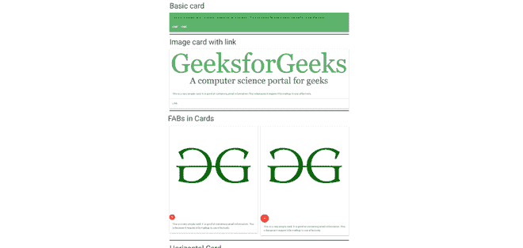
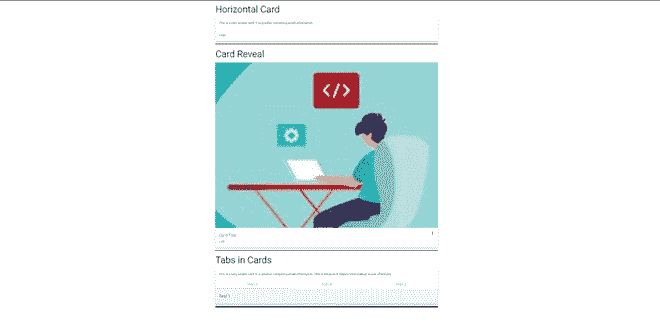
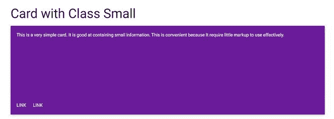
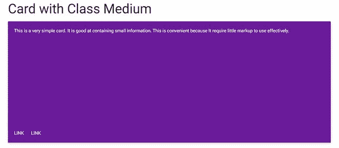
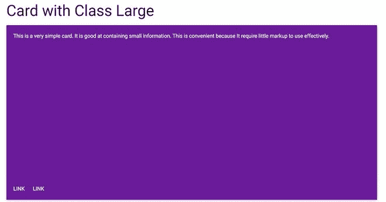
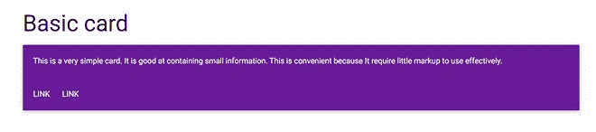

# 物化|卡片

> 原文:[https://www.geeksforgeeks.org/materialize-cards/](https://www.geeksforgeeks.org/materialize-cards/)

卡片是显示不同类型相关内容的便捷方式。物化使用卡片来呈现相似的对象，这些对象的大小和动作可以根据需要改变。下面是一个基本卡的例子。

## 基本示例

```html
<!DOCTYPE html>
<html>
    <head>
        <title>Page Title</title>
    </head>
    <body>
        <h3>Basic card</h3>
        <div class="card green lighten-1">
            <div class="card-content black-text">
                <span class="card-title"></span>
                <p>This is a very simple card.
                  It is good at containing small
                  information. This is convenient
                  because It require little markup
                  to use effectively.</p>
            </div>
            <div class="card-action">
                <a href="#"
                   class="white-text">Link</a>
                <a href="#"
                   class="white-text">Link</a>
            </div>
        </div>
    </body>
</html>
```

物化根据需要提供不同类型的卡，名称如下:

*   **图像卡** : 借助图像缩略图作为标准卡使用。为此在`card`类内增加了`card-image`类。
*   **卡片中的晶圆厂** : 在图像卡片内，可以添加不同大小的浮动动作按钮。
*   **横版卡片** : 在这里，空间被分成两个区块，一边用于图像，另一边用于信息。
*   **卡片展示** : 用于添加额外的信息，点击即可访问。为此，`card-reveal` div 被添加了 `span card-title`类，为了打开牌展示，`activator`类被添加到牌内的一个元素中。
*   **卡片中的标签** : 用于在卡片中添加不同的标签。为此，在标题和标签内容之间添加了`card-panel`类。
*   **卡牌面板** : 这是用于一张简单的卡牌，需要最小的标记，带有填充和阴影效果。

**这里展示了一个使用以上所有卡片的例子:**

## 综合示例

```html
<!DOCTYPE html>
<html>
    <head>
        <!--Import Google Icon Font-->
        <link href="https://fonts.googleapis.com/icon?family=Material+Icons"
              rel="stylesheet" />
        <!-- Compiled and minified CSS -->
        <link rel="stylesheet"
              href="https://cdnjs.cloudflare.com/ajax/libs/materialize/0.97.5/css/materialize.min.css" />
        <script type="text/javascript"
                src="https://code.jquery.com/jquery-2.1.1.min.js">
        </script>
        <!--Let browser know website is optimized for mobile-->
        <meta name="viewport"
              content="width=device-width, initial-scale=1.0" />
    </head>
    <body>
        <div class="container">
            <h3>Basic card</h3>
            <div class="card green lighten-1">
                <div class="card-content black-text">
                    <span class="card-title"></span>
                    <p>This is a very simple card.
                      It is good at containing small
                      information. This is convenient
                      because It require little markup
                      to use effectively.</p>
                </div>
                <div class="card-action">
                    <a href="#"
                       class="white-text">Link</a>
                    <a href="#"
                       class="white-text">Link</a>
                </div>
            </div>
            <div class="divider black"></div>
            <h3>Image card with link</h3>
            <div class="card">
                <div class="card-image">
                    
                    <span class="card-title"></span>
                </div>
                <div class="card-content">
                    <p>This is a very simple card.
                      It is good at containing small
                      information.This is because It
                      require little markup to use
                      effectively.</p>
                </div>
                <div class="card-action">
                    <a href="#"
                       class="green-text">Link</a>
                </div>
            </div>
            <div class="divider black"></div>
            <div class="row">
                <h2>FABs in Cards</h2>
                <div class="col s12 m6">
                    <div class="card">
                        <div class="card-image">
                            
                            <span class="card-title">Card Title</span>
                            <a class="btn-floating halfway-fab waves-effect waves-light red">
                                <i class="material-icons">add</i>
                            </a>
                        </div>
                        <div class="card-content">
                            <p>This is a very simple card. It is good at containing small information. This is because It require little markup to use effectively.</p>
                        </div>
                    </div>
                </div>
                <div class="col s12 m6">
                    <div class="card">
                        <div class="card-image">
                            
                            <span class="card-title">Card Title</span>
                            <a class="btn-floating btn-large halfway-fab waves-effect waves-light red">
                                <i class="material-icons">add</i>
                            </a>
                        </div>
                        <div class="card-content">
```

 

## 卡片尺寸

我们也可以使用物化 CSS 类制作统一大小的卡片。

### 语法

#### 小尺寸卡片

`small` 类用于制作高度高达 300px 的卡片。

```html
<div class="card small">
  <!-- Card Content -->
</div>
```

#### 中等尺寸卡片

`medium` 类用于制作高度高达 400 像素的卡片。

```html
<div class="card medium">
  <!-- Card Content -->
</div>
```

#### 大尺寸卡片

`large` 类用于制作高度高达 500px 的卡片。

```html
<div class="card large">
  <!-- Card Content -->
</div>
```

**注:**

*   我们还可以使用 CSS 为卡片定义自定义高度。
*   如果我们不提任何卡片大小或类别，那么卡片得到的高度和宽度默认为 `auto`，即高度和宽度随着内容的增加而增加。

### 完整的代码示例

下面是一个代码示例，显示了不同大小的不同卡片:

```html
<!DOCTYPE html>
<html>

<head>
    <!--Import Google Icon Font-->
    <link href="https://fonts.googleapis.com/icon?family=Material+Icons" rel="stylesheet" />

    <!-- Compiled and minified CSS -->
    <link rel="stylesheet" href="https://cdnjs.cloudflare.com/ajax/libs/materialize/0.97.5/css/materialize.min.css" />

    <script type="text/javascript" src="https://code.jquery.com/jquery-2.1.1.min.js">
    </script>

    <!--Let browser know website is optimized for mobile-->
    <meta name="viewport" content="width=device-width, initial-scale=1.0" />
</head>

<body>
    <div class="container">
        <h3>Card with Class Small </h3>
        <div class="card purple darken-3 small">
            <div class="card-content">
                <span class="card-title">
                </span>
                <p class="white-text">This is a very simple card.
                    It is good at containing small
                    information. This is convenient
                    because It require little markup
                    to use effectively.</p>

            </div>
            <div class="card-action">
                <a href="#" class="white-text">Link</a>
                <a href="#" class="white-text">Link</a>
            </div>

        </div>
    </div>
    <div class="container">
        <h3>Card with Class Medium</h3>
        <div class="card purple darken-3 medium">
            <div class="card-content">
                <span class="card-title">
                </span>
                <p class="white-text">This is a very simple card.
                    It is good at containing small
                    information. This is convenient
                    because It require little markup
                    to use effectively.</p>

            </div>
            <div class="card-action">
                <a href="#" class="white-text">Link</a>
                <a href="#" class="white-text">Link</a>
            </div>

        </div>
    </div>
    <div class="container">
        <h3>Card with Class Large</h3>
        <div class="card purple darken-3 large">
            <div class="card-content">
                <span class="card-title">
                </span>
                <p class="white-text">This is a very simple card.
                    It is good at containing small
                    information. This is convenient
                    because It require little markup
                    to use effectively.</p>

            </div>
            <div class="card-action">
                <a href="#" class="white-text">Link</a>
                <a href="#" class="white-text">Link</a>
            </div>

        </div>
    </div>

    <!-- Compiled and minified JavaScript -->
    <script src="https://cdnjs.cloudflare.com/ajax/libs/materialize/0.97.5/js/materialize.min.js">
    </script>
</body>

</html>
```

### 输出

  

## 彩色卡片

我们也可以制作不同颜色的卡片，也可以从[物化 CSS 调色板](https://materializecss.com/color.html)中使用不同的颜色给卡片添加不同的文本颜色。

### 语法

```html
<div class="card purple darken-3">
<!-- Card Content -->
</div>
```

### 完整的代码示例

## 超文本标记语言

```html
<!DOCTYPE html>
<html>

<head>
    <!--Import Google Icon Font-->
    <link href="https://fonts.googleapis.com/icon?family=Material+Icons" rel="stylesheet" />

    <!-- Compiled and minified CSS -->
    <link rel="stylesheet" href="https://cdnjs.cloudflare.com/ajax/libs/materialize/0.97.5/css/materialize.min.css" />

    <script type="text/javascript" src="https://code.jquery.com/jquery-2.1.1.min.js">
    </script>

    <!--Let browser know website is
            optimized for mobile-->
    <meta name="viewport" content="width=device-width,
                       initial-scale=1.0" />
</head>

<body>
    <div class="container">
        <h3>Basic card</h3>
        <div class="card purple darken-3">
            <div class="card-content">
                <span class="card-title">
                </span>
                <p class="white-text">This is a very simple card.
                    It is good at containing small
                    information. This is convenient
                    because It require little markup
                    to use effectively.</p>

            </div>
            <div class="card-action">
                <a href="#" class="white-text">Link</a>
                <a href="#" class="white-text">Link</a>
            </div>
        </div>

        <!-- Compiled and minified JavaScript -->
        <script src="https://cdnjs.cloudflare.com/ajax/libs/materialize/0.97.5/js/materialize.min.js">
        </script>
</body>

</html>
```

### 输出:



### 支持的浏览器:

*   谷歌 Chrome
*   勇敢的浏览器
*   Mozilla Firefox
*   歌剧
*   旅行队
*   微软边缘