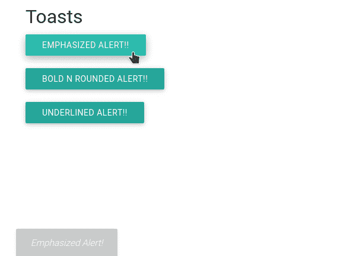

# Materialize：介绍与安装

> 原文：[https://www.geeksforgeeks.org/materialize-introduction-and-installation/](https://www.geeksforgeeks.org/materialize-introduction-and-installation/)

## 简介
Materialize 是一种将成功设计的经典原则与创新和技术相结合的设计语言。Materialize 由 Google 创建和设计。Google 的目标是开发一个设计系统，允许任何平台上所有产品的统一用户体验。

## 特征
*   它更容易使用。
*   它使网页充满活力，反应迅速。
*   它使网页兼容手机，平板电脑，笔记本电脑。
*   在 [materializecss.com](https://materializecss.com/) 免费提供。

## 安装 Materialize
安装 Materialize 有以下两种方式。

### 方法 1
前往 Materialize CSS 的[官方文档](https://materializecss.com/getting-started.html)，下载可用的最新版本。然后把下载的 `materialize.min.js` 和 `materialize.min.css` 文件放到你的项目目录中。

### 方法 2
也可以用 CDN 版本安装。在脚本标签中包含以下 CDN 链接。

```html
<link rel="stylesheet" href="https://cdnjs.cloudflare.com/ajax/libs/materialize/1.0.0/css/materialize.min.css">
<script src="https://cdnjs.cloudflare.com/ajax/libs/materialize/1.0.0/js/materialize.min.js"></script>
```

现在我们用一个例子来理解 Materialize 的工作原理。

## 示例
下面的示例展示了 Materialize CSS 中对话框的实现。

### HTML

```html
<!DOCTYPE html>
<html>

<head>
    <link rel="stylesheet" href=
"https://cdnjs.cloudflare.com/ajax/libs/materialize/0.97.3/css/materialize.min.css">
    <script type="text/javascript"
src="https://code.jquery.com/jquery-2.1.1.min.js"></script>
    <script src=
"https://cdnjs.cloudflare.com/ajax/libs/materialize/0.97.3/js/materialize.min.js">
    </script>

<script>
        function Toast1(string, timeLength) {
            Materialize.toast(
                '<em>' + string + '</em>', timeLength
            );
        }
        function Toast2(string, timeLength) {
            Materialize.toast(
                '<b>' + string + '</b>', timeLength, 'rounded'
            );
        }
        function Toast3(string, timeLength) {
            Materialize.toast(
                '<u>' + string + '<u>', timeLength
            );
        }
    </script>
</head>

<body>
    <body class="container">
        <h4>Toasts</h4>
        <a class="btn" onclick=
            "Toast1('Emphasized Alert!', 1500)">
            Emphasized Alert!!
        </a><br><br>

        <a class="btn" onclick=
            "Toast2('Bold N rounded Alert!', 1500)">
            Bold N rounded Alert!!
        </a><br><br>

        <a class="btn" onclick=
            "Toast3('Underlined Alert!', 1500)">
            Underlined Alert!!
        </a><br><br>
    </body>
</body>

</html>
```

### 输出
