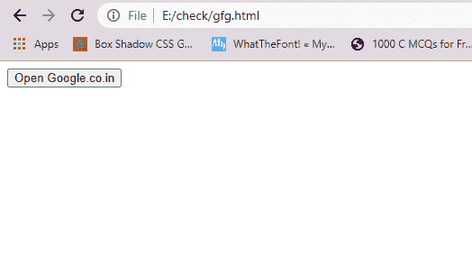

# 窗口对象

## 属性

> Original: [https://www.geeksforgeeks.org/properties-of-window-object/](https://www.geeksforgeeks.org/properties-of-window-object/)

窗口对象是 DOM 层次结构的最顶层对象。它表示显示网页内容的浏览器窗口或框架。每当屏幕上出现显示文档内容的窗口时，都会创建窗口对象。下表列出了窗口对象的常用属性和方法：

**窗口对象的属性**

<figure class="table">

| **属性名** | **目的** |
| --- | --- |
| `closed` | 它持有一个布尔值，指示窗口是否已关闭。 |
| `console` | 它返回对 `Console` 对象的引用，该对象提供对浏览器调试控制台的访问。 |
| `defaultStatus` | 它用于定义当浏览器不执行任何活动时，将在状态栏中显示的默认消息。 |
| `controller` | 它返回当前 Chrome 窗口的 XUL 控制器对象。 |
| `customElements` | 它返回对 `CustomElementRegistry` 对象的引用，该对象可用于注册新的自定义元素并获取有关已注册自定义元素的信息。 |
| `crypto` | 它返回浏览器加密对象。 |
| `devicePixelRatio` | 它返回当前显示器中物理像素与设备无关像素的比率。 |
| `document` | 它返回对窗口 `Document` 对象的引用。 |
| `DOMMatrix` | 它返回对 `DOMMatrix` 对象的引用，该对象表示 4 × 4 矩阵，适用于 2D 和 3D 操作。 |
| `frames[]` | 它表示给定窗口的所有帧的数组。 |
| `DOMPoint` | 它返回对 `DOMPoint` 对象的引用，该对象表示坐标系中的 2D 或 3D 点。 |
| `history` | 它提供有关当前窗口中访问的 URL 的信息。 |
| `length` | 它表示当前窗口中的帧数。 |
| `location` | 它返回对 `DOMRect` 对象的引用，该对象表示一个矩形。 |
| `fullscreen` | 此属性指示窗口是否以全屏显示。 |
| `locationbar` | 它包含当前窗口的 URL。 |
| `innerHeight` | 它用于获取浏览器窗口内容区域的高度。 |
| `innerWidth` | 它用于获取浏览器窗口内容区域的宽度。 |
| `name` | 它包含引用窗口的名称。 |
| `opener` | 它包含对打开当前窗口的窗口的引用。 |
| `parent` | 包含当前帧的帧的集合。 |
| `screen` | 它引用 `Screen` 对象。 |
| `self` | 它提供了引用当前窗口的另一种方式。 |
| `status` | 它覆盖 `defaultStatus` 并在状态栏中放置一条消息。 |
| `top` | 如果打开了多个窗口，它返回对包含该帧的最顶层窗口的引用。 |
| `window` | 它返回当前窗口或帧。 |
| `navigator` | 它返回对 `Navigator` 对象的引用。 |
| `outerHeight` | 它将获取浏览器窗口外部的高度。 |
| `outerWidth` | 它将获取浏览器窗口外部的宽度。 |
| `toolbar` | 它生成一个工具栏对象，其可见性可以在窗口中切换。 |

</figure>

要访问窗口对象的属性，您需要指定对象名称，后跟句号（`.`）和属性名称。

**语法：**

```html
window.property_name
```

**示例：**

## HTML

```html
<!DOCTYPE html>
<html>

<head>
    <script language="JavaScript">
        function winopen() {
            window.open("https://www.geeksforgeeks.org")
        }
        function showstatus() {
            window.status =
                "Opening GeeksforGeeks Home page";
        }
    </script>
</head>

<body onload="showstatus()">
    <input type="button" name="btn"
        value="Open GeeksforGeeks"
        onclick="winopen()">
</body>

</html>
```

**在点击按钮之前：**



**点击按钮后：**

