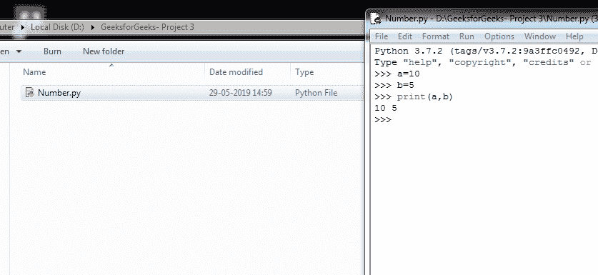
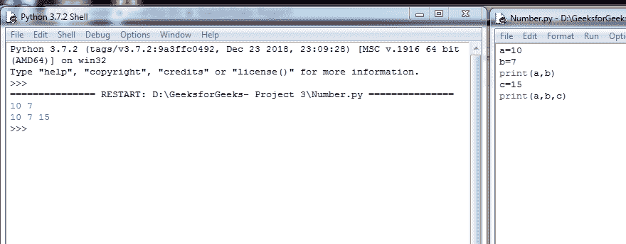
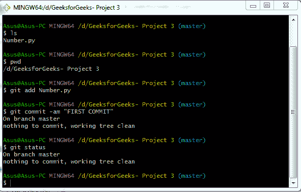
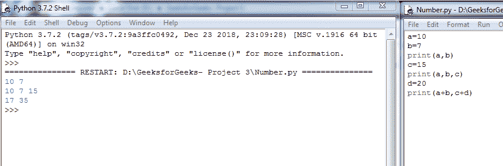
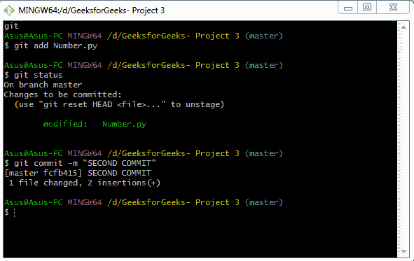

# 用 Git 保存文件

> 原文：[https://www.geeksforgeeks.org/saving-a-file-in-git/](https://www.geeksforgeeks.org/saving-a-file-in-git/)

在 git 中保存文件或文件集合的方法与在文件编辑器中完全不同。为了保存 git 项目的最新版本，我们将使用以下命令：

1.  `git add`
2.  `git status`
3.  `git commit`

## Git add

`git add` 是一个暂存的命令。它充当用户和 git 之间的中介。它通知 git，更改将包含在下一阶段中。除非调用 `git commit` 命令，否则它不会影响存储库。

## Git status

顾名思义，该命令显示工作区和暂存区的状态。它显示工作目录中的路径，并列出被跟踪或未被跟踪的文件。这个命令非常有帮助，因为它让用户在真正提交他不想做的更改之前知道他在做什么。

## Git commit

这个命令捕捉到了变化。这个命令和 `git add` 是最常用的命令之一。`git commit` 和 `git add` 是相互配合的命令。

以下是 `git commit` 命令的一些重要选项：

*   `-a`
    它包括此提交中所有当前已更改的文件，但新的未跟踪文件不受影响。
*   `-m "message"`
    这将创建一个提交命令，并显示一条消息。默认情况下，此命令打开本地配置的文本编辑器。
*   `-am "message"`
    这是一个结合了 `-a` 和 `-m` 选项的快捷命令。
*   `--amend`
    该选项允许用户修改最后一次提交。如果用户没有用 `-m` 指定提交消息，默认情况下，他/她将被提示上一个提交命令的消息。该命令不创建新的提交，而是修改最后一个提交。

### 下面是上面命令如何工作的快照

**创建 python 文件**

**使用 `git add`，`git status`，`git commit` 命令在我们的第一个 commit**

**在 IDLE 中更改或更新 `Number.py` 文件并保存**

**再次使用 `git add`，`git status`，`git commit` 命令在我们的第二次提交**

## 汇总

`git add` 和 `git commit` 命令是核心命令。`git add` 用于告诉下一个提交命令需要转移的更改。然后 `git commit` 用于对阶段化的变更进行快照。`git status` 用于提供暂存区的状态。