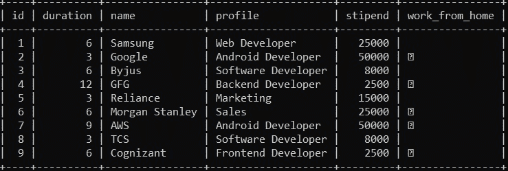
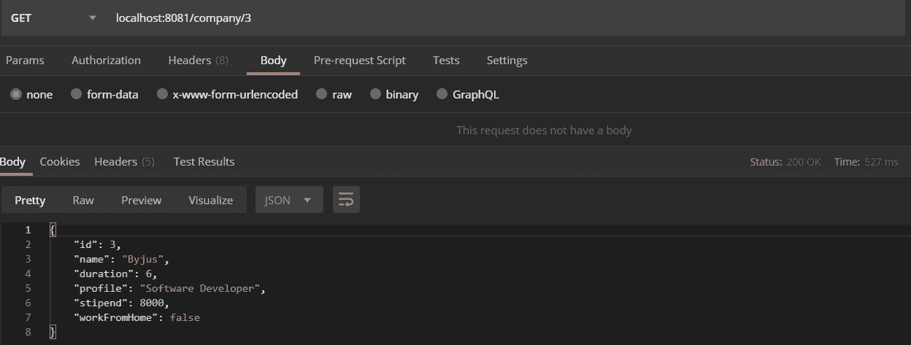

# Spring Boot：如何使用 Spring Data JPA 访问数据库

> 原文：[https://www.geeksforgeeks.org/spring-boot-how-to-access-database-using-spring-data-jpa/](https://www.geeksforgeeks.org/spring-boot-how-to-access-database-using-spring-data-jpa/)

**Spring Data JPA** 是实现 JPA 存储库的一种方法，方便在应用中添加数据访问层。CRUD 代表创建、检索、更新、删除，这些都是可以在数据库中执行的操作。在本文中，我们将看到一个示例，说明如何在使用 Spring Data JPA 的 Spring Boot 应用程序中从数据库访问数据。

为了学习如何创建一个 Spring Boot 项目，参考[这篇文章](https://www.geeksforgeeks.org/how-to-create-a-basic-application-in-java-spring-boot/?ref=rp)。

数据库是相互关联的数据的集合，有助于从数据库中高效地检索、插入和删除数据，并以表、视图、模式、报告等形式组织数据。因此，对于任何应用程序来说，数据库都是最重要的模块之一，需要有一种与之通信的方式。因此，要使用 Spring Data JPA 访问数据库，需要遵循以下步骤：

## 步骤 1：创建 Spring Boot 项目

转到 [Spring Initializr](https://start.spring.io/) 并创建一个具有以下依赖关系的新项目：
*   Spring Web
*   Spring Data
*   MySQL Driver

## 步骤 2：导入项目

下载入门项目并将其导入到 IDE 中。

## 步骤 3：创建模型类

项目同步后，我们将创建一个模型类 `Company`，注释 `@Entity`，这意味着这个类被映射到数据库中的表。添加数据类型与数据库中的列相同的数据成员，并生成构造函数和 getters。将注释 `@Id` 添加到数据成员中，该数据成员将作为表中的主键属性，并将 `@GeneratedValue(strategy = GenerationType.AUTO)` 添加到数据成员中，以便自动增加主键属性。下面是这个类的实现：

```java
@Entity
public class Company {

    // Primary ID which increments
    // automatically when new entry
    // is added into the database
    @Id
    @GeneratedValue(strategy
                    = GenerationType.AUTO)
    int id;

    String name;

    // In months
    int duration;
    String profile;

    // Can be 0
    int stipend;
    boolean workFromHome;

    public Company()
    {
    }

    // Parameterized constructor
    public Company(String name, int duration,
                   String profile,
                   int stipend,
                   boolean workFromHome)
    {
        this.name = name;
        this.duration = duration;
        this.profile = profile;
        this.stipend = stipend;
        this.workFromHome = workFromHome;
    }

    // Getters and setters of
    // the variables
    public int getId()
    {
        return id;
    }

    public String getName()
    {
        return name;
    }

    public int getDuration()
    {
        return duration;
    }

    public String getProfile()
    {
        return profile;
    }

    public int getStipend()
    {
        return stipend;
    }

    public void setId(int id)
    {
        this.id = id;
    }

    public boolean isWorkFromHome()
    {
        return workFromHome;
    }
}
```

## 步骤 4：创建 Repository 接口

现在，创建一个[接口](https://www.geeksforgeeks.org/interfaces-in-java/) `CompanyRepository`，使用注解 `@Repository`，它将实现 `CrudRepository`。执行 CRUD 操作的函数将在接口中定义，如下所示：

```java
@Repository
public interface CompanyRepository
    extends CrudRepository<Company,
                           Integer> {

    Company findById(int id);
    List<Company> findAll();
    void deleteById(int id);
}
```

**注意：** 功能不会实现，因为它们已经在 `CrudRepository` 中实现。

## 步骤 5：创建 REST API

现在，我们将创建 REST API（GET、POST、PUT、DELETE），如下所示：

```java
@RestController
public class CompanyController {
    @Autowired
    private CompanyRepository repo;

    // Home Page
    @GetMapping("/")
    public String welcome()
    {
        return "<html><body>"
            + "<h1>WELCOME</h1>"
            + "</body></html>";
    }

    // Get All Notes
    @GetMapping("/company")
    public List<Company> getAllNotes()
    {
        return repo.findAll();
    }

    // Get the company details by
    // ID
    @GetMapping("/company/{id}")
    public Company getCompanyById(
        @PathVariable(value = "id") int id)
    {
        return repo.findById(id);
    }

    @PostMapping("/company")
    @ResponseStatus(HttpStatus.CREATED)
    public Company addCompany(
        @RequestBody Company company)
    {
        return repo.save(company);
    }

    @DeleteMapping("/delete/{id}")
    public void deleteStudent(
        @PathVariable(value = "id") int id)
    {
        repo.deleteById(id);
    }

    @PutMapping("/company/{id}")
    public ResponseEntity<Object> updateStudent(
        @RequestBody Company company,
        @PathVariable int id)
    {

        Optional<Company> companyRepo
            = Optional.ofNullable(
                repo.findById(id));

        if (!companyRepo.isPresent())
            return ResponseEntity
                .notFound()
                .build();

        company.setId(id);

        repo.save(company);

        return ResponseEntity
            .noContent()
            .build();
    }
}
```

## 步骤 6：配置数据库连接

现在，打开 `application.properties` 文件并添加以下代码。将 `database_name` 替换为包含表 `Company` 的数据库名，`username` 替换为 MySQL 服务器的用户名（默认为 `root`），并将 `password` 替换为 MySQL 密码。

```properties
spring.datasource.url=jdbc:mysql://localhost:3306/database_name
spring.datasource.username=username
spring.datasource.password=password
spring.jpa.hibernate.ddl-auto=update
```

## 步骤 7：运行与测试

这完成了建立数据库连接的过程。现在，我们构建并运行项目，然后调用不同的 API。

**注意：** Postman 通常更倾向于测试调用 API，因此我们使用了 Postman 工具来测试项目。

**输出：**

*   数据库：

[](https://media.geeksforgeeks.org/wp-content/uploads/20200607222333/table8.jpg)

*   使用 [Postman collection](https://www.geeksforgeeks.org/introduction-postman-api-development/) 进行测试：

[](https://media.geeksforgeeks.org/wp-content/uploads/20200607222535/get.jpg)