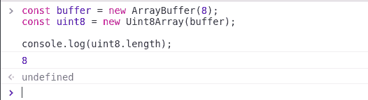
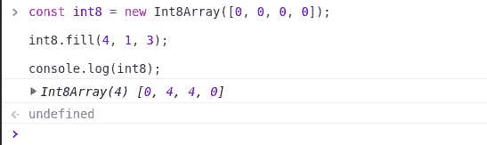
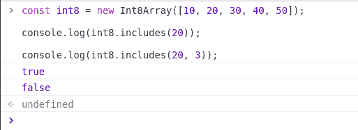

# TypedArray 简介

> 原文：[https://www.geeksforgeeks.org/typedarray-introduction/](https://www.geeksforgeeks.org/typedarray-introduction/)

`TypedArray` 演示了二进制数据缓冲区的类似数组的视图。它们是在 ECMAScript 版本 6 中引入的，用于处理二进制数据。没有保留关键字 `TypedArray`，也没有直接可见的 `TypedArray` 构造器。

类型有几种类型，如下图所示，有范围、大小、网页 IDL 类型、等效 C 类型：

| **类型** | **范围值** | **大小(字节)** | **Web IDL 类型** | **等价 C 类型** |
| :--- | :--- | :--- | :--- | :--- |
| `Int8Array` | -128 至 127 | 1 | `byte` | `int8_t` |
| `Uint8Array` | 0 至 255 | 1 | `.octet` | `uint8_t` |
| `Uint8ClampedArray` | 0 至 255 | 1 | `octet` | `uint8_t` |
| `Int16Array` | -32768 至 32767 | 2 | `short` | `int16_t` |
| `Uint16Array` | 0 至 65535 | 2 | `unsigned short` | `uint16_t` |
| `Int32Array` | -2147483648 至 2147483647 | 4 | `long` | `int32_t` |
| `Uint32Array` | 0 至 4294967295 | 4 | `unsigned long` | `uint32_t` |
| `Float32Array` | -3.4E38 至 3.4E38 | 4 | `unrestricted float` | `float` |
| `Float64Array` | -1.8E308 至 1.8E308 | 8 | `unrestricted double` | `double` |
| `BigInt64Array` | -2^63 至 2^63-1 | 8 | `bigint` | `int64_t` |
| `BigUint64Array` | 0 至 2^64-1 | 8 | `bigint` | `uint64_t` |

**构造函数：** 该对象不能直接实例化。相反，您必须创建一个特定类型的数组实例，例如一个 `Uint8Array` 或 `BigInt64Array`。
创建 `TypedArray` 的实例时（例如 `Int8Array`），也会在内存内部创建一个 `ArrayBuffer` 实例，或者，如果一个 `ArrayBuffer` 对象作为一个构造函数参数给出，那么就用那个参数代替。
我们可以通过在各自的构造函数中使用 `new` 关键字来创建 `TypedArray` 的实例。

**语法：**

```html
new TypedArray();
// Or
new TypedArray(length);
// Or
new TypedArray(typedArray);
// Or
new TypedArray(object);
// Or
new TypedArray(buffer [, byteOffset [, length]]);
```

类型可以是上面提到任何类型。

**参数：** 以下是 `TypedArray` 可以采用的参数：

*   `length`：要创建的数组缓冲区的大小。
*   `typedArray`：要创建的数组类型。
*   `object`：当用对象参数调用时，会创建一个新的类型化数组实例。
*   `buffer`、`byteOffset`、`length`：当用缓冲区、字节集合、和一个长度参数调用时，会创建一个新的类型化数组视图，用于查看指定的数组缓冲区。

**实例化一个 TypedArray：** 下面是一些展示如何实例化 `TypedArray` 的例子。

**例 1：**

## JavaScript

```html
const buffer = new ArrayBuffer(8);

// Initiating using the constructor
const uint8 = new Uint8Array(buffer);

// Output is 8 as we initiated the length with 8
console.log(uint8.length);
```

**输出：**



**例 2：**

## JavaScript

```html
const int8 = new Int8Array([0, 0, 0, 0]);

int8.fill(4, 1, 3);

console.log(int8);
```

**输出：**



**示例 3：** 检查值是否包含在 `TypedArray` 中。

## JavaScript

```html
const int8 = new Int8Array([10, 20, 30, 40, 50]);

console.log(int8.includes(20));

console.log(int8.includes(20, 3));
```

**输出：**

