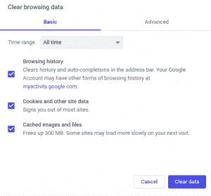
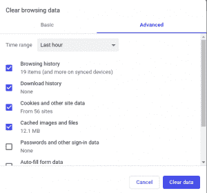

# 追踪网站的方法

> 原文:[https://www.geeksforgeeks.org/ways-to-track-a-website/](https://www.geeksforgeeks.org/ways-to-track-a-website/)

每当我们访问任何网站时，我们的网络浏览器都会显示我们的位置、搜索和浏览历史等。这些数据还可能被第三方使用。各种网络通常使用跟踪来建立详细的档案，用于各种目的，例如实现政治选择。

有许多方法可以跟踪网站，包括:

## IP 地址
`IP` 地址是我们连接互联网时设备的唯一地址。这个地址与我们家中或办公室的其他联网设备共享。利用这个，网站可以确定我们大致的地理位置。该 `IP` 地址可以改变，因此通过长时间使用该 `IP` 地址来跟踪特定用户是困难的。通过 `IP` 地址网站不能追踪用户的 `pin-drop` 位置，但可以很容易地追踪地区或城市。这个过程基本上是通过垃圾广告进行的。

## HTTP Referrer
每当我们点击浏览器中的任何链接时，它都会加载链接到的网页。网站将被打开，并且诸如 `IP` 地址、位置、网络浏览器、机器类型等信息将被提供给链接的网站。这被称为 **HTTP referrer**。如果你点击网页之外的链接，那么该网页将获得关于你的信息。假设你点击了一个“How to track”（在网页之外）的链接，那么该链接将看到你来自哪里，这被称为 `HTTP refer` 头。

一个网页可以包括一个跟踪脚本，它会告诉广告商你正在寻找的网页。
网络 bug 是这里最不可追踪的程序，那些包含在图像中的非常小的 bug，它被用在邮件中，假设你打开一封包含图像的邮件，那么广告商可以追踪你。

## Cookies 和跟踪脚本
`Cookies` 是你计算机上的小型文本文件，存储着与你在线习惯相关的一小块信息。`Cookies` 也可以识别你并跟踪你在网站上的活动。跟踪脚本会发送你当时正在查看哪个页面的信息。
`Cookies` 通常有两种类型：
*   **第一方 cookie:** 这些存储了我们自己的登录 `id`、密码、自动填充信息等，供经常访问的网站使用。
*   **第三方 cookie:** 这些是存储我们的浏览数据，并根据我们的兴趣使用这些在我们的网页上放置广告的 cookie。这有时会导致我们的网页上出现许多不需要的广告。

## Super Cookies
这些也是 `cookie`（如 `evercookie`），但具有持久性。它们将数据存储在多个地方（`Flash` `cookies`、`Silverlight` 存储和 `HTML 5` 本地存储等）。如果你删除了其中一部分，信息将从其他位置重新填充。假设你从浏览器中清除了 `cookie`，但没有清除 `Flash` `cookies`，那么浏览器将从 `Flash` `cookies` 复制 `cookie` 并重新填充到你的浏览器中，某种程度上，`supercookie` 就像无法完全消失的 `evercookie`。

`supercookie` 的目标是记住每一个用户，如果你清除了所有的 `cookie`，它将从其他存储中重新填充。`supercookie` 使用备份计划。

## 用户代理
每次我们连接到一个网站时，我们的浏览器都会向该网站发送一个用户代理，该代理从我们这里收集浏览器类型、操作系统和重要数据等数据，广告商使用这些数据在我们的网页上定向广告我们喜欢看什么，我们想看什么。

## 浏览器指纹识别
每个浏览器都是特别独特的，这告诉网站你安装的字体、插件以及你在浏览器中使用的所有东西。如果你禁用你的 `cookies` 来阻止这些事情，那么这将是另一种追踪你的方式，禁用选项将告诉网站你的信息。

上述所有事情都会将个人身份信息泄露给网站，并可能通过收集您的所有个人信息而被用来对付您。对此的解决方案是*私人浏览*、*匿名浏览*。