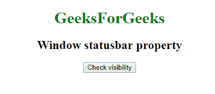
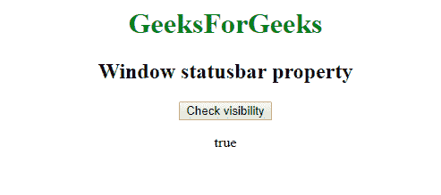

# 网络窗口应用编程接口：窗口状态栏属性

> 原文：[https://www.geeksforgeeks.org/web-window-api-window-statusbar-property/](https://www.geeksforgeeks.org/web-window-api-window-statusbar-property/)

在 Web API 中，`Window.statusbar` 属性返回代表 `statusbar` 的对象，可以查看其 `visible` 属性。

**语法：**

```html
objectReference = window.statusbar
```

**示例：** 检查能见度

```html
<!DOCTYPE html>
<html>

<head>

<title>
        Window statusbar property
    </title>

<script type="text/javascript">
        function getvisibility() {

document.getElementById(
              'visibility').innerHTML = window.statusbar.visible;

}
    </script>

</head>

<body>
    <center>

<h1 style="color:green;">  
                GeeksForGeeks  
            </h1>

<h2>Window statusbar property</h2>
        <button onclick="getvisibility ();" 
                id="btn">Check visibility</button>
        <p id='visibility'></p>
    </center>
</body>

</html>
```

**输出：**

之前：


之后：


**支持的浏览器：**

*   谷歌 Chrome
*   边缘 12
*   火狐浏览器
*   旅行队
*   歌剧