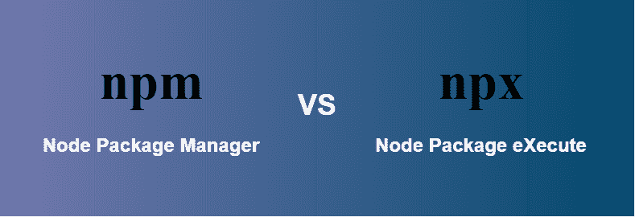

# NPM 和 npx 有什么区别？

> 原文：[https://www.geeksforgeeks.org/what-are-the-differences-between-npm-and-npx/](https://www.geeksforgeeks.org/what-are-the-differences-between-npm-and-npx/)



## NPM

[NPM](https://www.geeksforgeeks.org/node-js-npm-node-package-manager/) 代表 **Node 包管理器**，它是 [Node.js](https://www.geeksforgeeks.org/introduction-to-nodejs/) 的默认包管理器。它完全是用 [JavaScript](https://www.geeksforgeeks.org/javascript-tutorial/) 编写的。`npm` 管理 Node.js 的所有包和模块，由命令行客户端 `npm` 组成。通过[安装 Node.js](https://www.geeksforgeeks.org/installation-of-node-js-on-windows/)，`npm` 会被安装到系统中。Node 项目中需要的包和模块使用 `npm` 安装。一个包包含一个模块所需的所有文件，模块是可以根据项目的要求包含在 Node 项目中的 JavaScript 库。

### 用 npm 执行包

*   **通过输入本地路径**：你必须写下你的包的本地路径，如下：
    ```html
    ./node_modules/.bin/your-package-name
    ```
*   **本地安装**：你要打开 `package.json` 文件，写下下面的脚本：
    ```html
    {
        "name": "Your app",
        "version": "1.0.0",
        "scripts": {
            "your-package": "your-package-name"
        }
    }
    ```

要运行包，之后您可以通过运行以下命令来运行包：
```html
npm run your-package-name
```

## NPX

`npx` 代表 **Node 包执行**，并且自带 `npm`。当你安装了 5.2.0 以上版本的 `npm`，那么自动会安装 `npx`。它是一个 `npm` 包运行器，可以从 npm 注册表中执行任何你想要的包，甚至不需要安装那个包。`npx` 在一次性使用包中非常有用。如果您安装了 5.2.0 以下的 `npm`，那么您的系统中不会安装 `npx`。您可以通过运行以下命令来检查 `npx` 是否已安装：
```bash
npx -v
```

如果没有安装 `npx`，您可以通过运行下面的命令单独安装它。
```bash
npm install -g npx
```

### 用 npx 执行包

*   **直接可运行**：你可以不安装就执行你的包，为此运行以下命令。
    ```bash
    npx your-package-name
    ```

## npm 和 npx 的区别

| **NPM** | **npx** |
| --- | --- |
| 如果你想通过 NPM 运行包，那么你必须在 `package.json` 中指定该包并在本地安装它。 | 包可以在不安装的情况下执行。它是一个 `npm` 包操作符，所以如果有一个包没有安装，它会自动安装。 |
| 在 npm 中使用 `create-react-app` 的命令是先 `npm install create-react-app`，然后 `create-react-app myApp`（需要安装）。 | 但在 npx 中，你不需要安装，直接运行 `npx create-react-app myApp` 即可。这个命令在每个应用程序的生命周期中只需要一次。 |
| Npm 是一个用于安装软件包的工具。 | Npx 是一个用于执行包的工具。 |
| NPM 使用的包是全局安装的，因此你应该担心长期的环境污染。 | npx 使用的软件包不是全局安装的，因此你不用担心长期的环境污染。 |