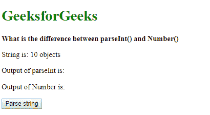
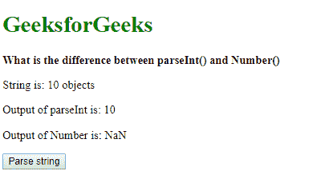
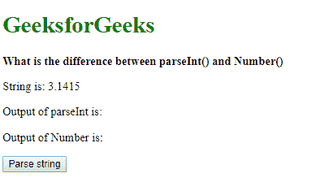
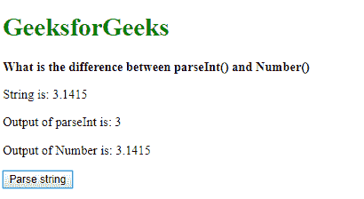
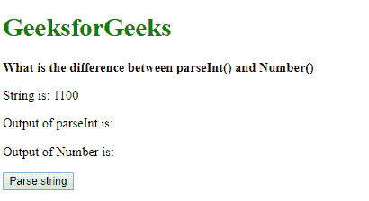
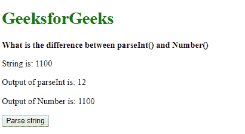

# parseInt()和Number()有什么区别？

> 原文:[https://www.geeksforgeeks.org/what-is-the-difference-between-parseint-and-number/](https://www.geeksforgeeks.org/what-is-the-difference-between-parseint-and-number/)

## The parseInt() function

`parseInt()`函数用于解析字符串并将其转换为指定基数的整数。它接受两个参数：要解析的字符串和要使用的基数。基数是一个介于2和36之间的整数，表示数字的进制。

如果`parseInt()`在解析时遇到不符合指定基数的字符，它将忽略该字符和所有后续字符。然后，它将解析到该点的值作为整数返回。在这种情况下，允许前导或尾随空格。

如果函数获得第一个字符，并且不能将其转换为数字，它将返回`NaN`，除非基数大于10。该`NaN`值对于任何基数都不是有效的数字，不能用于任何数学计算。

**语法:**

```html
parseInt(string, radix)
```

## The Number() function

`Number()`函数用于创建原始类型Number对象。它接受一个参数，即数字的值。这个值可以以字符串形式传递，`Number`函数将尝试将其表示为数字。如果参数无法转换为数字，则返回`NaN`值。此`NaN`值不是有效数字，不能用于任何数学计算。

**语法:**

```html
Number(valueString)
```

这些之间的差异可以用下面的例子来解释:

## 示例 1

此示例显示`parseInt()`尝试将该值转换为可以转换为整数的最后一个字符。尾部空格和字符被忽略，因为它们无效。另一方面`Number()`函数只是返回`NaN`。

```html
<!DOCTYPE html>
<html>

<head>
    <title>
      What is the difference between 
      parseInt() and Number()
  </title>
</head>

<body>
    <h1 style="color: green">
      GeeksforGeeks
  </h1>
    <b>
      What is the difference between
      parseInt() and Number()
  </b>
    <p>String is: 10 objects</p>
    <p>Output of parseInt is: <span class="parseOutput">
      </span>
  </p>
    <p>Output of Number is: <span class="numberOutput">
      </span>
  </p>
    <button onclick="parseNumber()">
      Parse string
  </button>
    <script type="text/javascript">
        function parseNumber() {
            let string = '10.6 objects';
            let number1 = parseInt(string);
            let number2 = Number(string);

document.querySelector(
              '.parseOutput').textContent = number1;
            document.querySelector(
              '.numberOutput').textContent = number2;
        }
    </script>
</body>

</html>
```

**输出:**

*   **点击按钮前:**
    
*   **点击按钮后:**
    

## 示例 2

本例展示了`parseInt()`只返回整数值而`Number()`返回包括浮点在内的所有数字的区别。

```html
<!DOCTYPE html>
<html>

<head>
    <title>
      What is the difference between 
      parseInt() and Number()
  </title>
</head>

<body>
    <h1 style="color: green">
      GeeksforGeeks
  </h1>
    <b>What is the difference between
      parseInt() and Number()
  </b>
    <p>String is: 3.1415</p>
    <p>Output of parseInt is: <span class="parseOutput">
      </span>
  </p>
    <p>Output of Number is: <span class="numberOutput">
      </span>
  </p>
    <button onclick="parseNumber()">Parse string</button>
    <script type="text/javascript">
        function parseNumber() {
            let string = '3.1415';
            let number1 = parseInt(string);
            let number2 = Number(string);

document.querySelector(
              '.parseOutput').textContent = number1;
            document.querySelector(
              '.numberOutput').textContent = number2;
        }
    </script>
</body>

</html>
```

**输出:**

*   **点击按钮前:**
    
*   **点击按钮后:**
    

## 示例 3

该示例显示了`parseInt()`中基数参数的工作方式。传递的字符串以2为基数进行分析。这将返回值12。另一方面，`Number()`按原样返回字符串中的值。

```html
<!DOCTYPE html>
<html>

<head>
    <title>
      What is the difference between 
      parseInt() and Number()
  </title>
</head>

<body>
    <h1 style="color: green">
      GeeksforGeeks
  </h1>
    <b>What is the difference between
      parseInt() and Number()
  </b>
    <p>String is: 1100</p>
    <p>Output of parseInt is: <span class="parseOutput">

</span></p>
    <p>Output of Number is: <span class="numberOutput">
      </span></p>
    <button onclick="parseNumber()">
      Parse string
  </button>

<script type="text/javascript">
        function parseNumber() {
            let string = '1100';
            let number1 = parseInt(string, 2);
            let number2 = Number(string);

document.querySelector(
              '.parseOutput').textContent = number1;
            document.querySelector(
              '.numberOutput').textContent = number2;
        }
    </script>
</body>

</html>
```

**输出:**

*   **点击按钮前:**
    
*   **点击按钮后:**
    