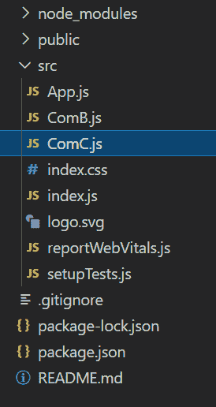
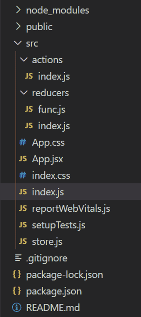
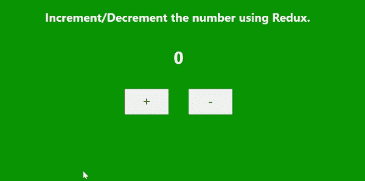

# useContext 和 Redux 有什么区别？

> 原文: [https://www.geeksforgeeks.org/whats-the-difference-between-usecontext-and-redux/](https://www.geeksforgeeks.org/whats-the-difference-between-usecontext-and-redux/)

## useContext

`useContext` 是一个钩子，它提供了一种通过组件树传递数据的方法，而无需手动通过每个嵌套组件向下传递道具。

### 语法

```javascript
const Context = useContext(initialValue);
```

### 项目结构

项目结构会是这样的。



### 示例

在本例中，`App.js` 正在 `useContext` 的帮助下向组件 `ComC` 发送数据。

**App.js**

```javascript
import React, { createContext } from 'react';
import "./index.css";
import ComB from './ComB';

const Data = createContext();

export default function App() {
  return (
    <div className="App">
      <Data.Provider value={"Welcome to GFG"}>
        <ComB />
      </Data.Provider>
    </div>
  );
}

export { Data };
```

**ComB.js**

```javascript
import React, { useState } from "react";
import ComC from "./ComC";

const ComB = () => {
  const [show, setShow] = useState(false);
  return (
    <>
      {show ? <ComC /> : null}
      <button onClick={() => setShow(!show)}>
        Click ME</button>
    </>
  );
}

export default ComB;
```

**ComC.js**

```javascript
import React, { useContext } from 'react';
import { Data } from './App';

const ComC = ({ name }) => {
  const context = useContext(Data);
  return <h1>{context}</h1>
}

export default ComC;
```

### 输出


## Redux

Redux 是 JavaScript 应用中使用的状态管理库。它在 React 和 React Native 中非常受欢迎。它主要管理应用程序的状态和数据。

### Redux 的架构部分

1.  Actions
2.  Reducers
3.  Store

### 项目结构

项目结构会是这样的。



### 示例

在本例中，我们创建了两个按钮，一个将增加值，另一个将减少值。使用 Redux，我们正在管理状态。

**App.js**

```javascript
import React from 'react';
import './index.css';
import { useSelector, useDispatch } from 'react-redux';
import { incNum, decNum } from './actions/index';

function App() {

  const mystate = useSelector((state) => state.change);
  const dispatch = useDispatch();

  return (
    <>
      <h2>Increment/Decrement the number using Redux.</h2>
      <div className="app">
        <h1>{mystate}</h1>
        <button onClick={() => dispatch(incNum())}>+</button>
        <button onClick={() => dispatch(decNum())}>-</button>
      </div>
    </>
  );
}

export default App;
```

**index.js** (在 `src/actions` 文件夹中)

```javascript
export const incNum = () => {
   return{ type:"INCREMENT"}
}

export const decNum = () => {
   return{ type:"DECREMENT"}
}
```

**func.js**

```javascript
const initialState = 0;

const change = (state = initialState, action) => {
  switch (action.type) {
    case "INCREMENT": return state + 1;
    case "DECREMENT": return state - 1;
    default: return state;
  }
}

export default change;
```

**index.js** (在 `src/reducers` 文件夹中)

```javascript
import change from './func'
import {combineReducers} from 'redux';

const rootReducer = combineReducers({change});

export default rootReducer;
```

**store.js**

```javascript
import {createStore} from 'redux';
import rootReducer from './reducers/index';

const store = createStore(rootReducer,window.__REDUX_DEVTOOLS_EXTENSION__ && 
window.__REDUX_DEVTOOLS_EXTENSION__());

export default store;
```

**index.js** (在 `src` 文件夹中)

```javascript
import React from 'react';
import ReactDOM from 'react-dom';
import './index.css';
import App from './App.jsx'
import store from './store';
import { Provider } from 'react-redux';

ReactDOM.render(
  <Provider store={store}>
    <App />
  </Provider>
  , document.getElementById("root")
);
```

### 输出



## useContext 与 Redux 的一些区别

| **useContext** | **Redux** |
| --- | --- |
| `useContext` 是一个钩子。 | Redux 是一个状态管理库。 |
| 它用于共享数据。 | 用于管理数据和状态。 |
| 使用上下文值进行更改。 | 使用纯函数（即 reducer）进行更改。 |
| 我们可以在其中改变状态。 | 状态是只读的。我们不能直接改变它们。 |
| 只要提供者的值通道有任何更新，它就会重新渲染所有组件。 | 它只重新渲染已更新的组件。 |
| 最适合小型应用程序。 | 非常适合大规模应用程序。 |
| 简单易懂，需要的代码较少。 | 理解起来相当复杂。 |