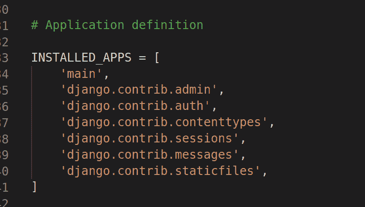
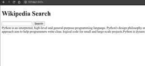

# 使用 Django 的维基百科搜索应用项目

> 原文：[https://www.geeksforgeeks.org/wikipedia-search-app-project-using-django/](https://www.geeksforgeeks.org/wikipedia-search-app-project-using-django/)

Django 是一个基于 Python 的高级网络框架，允许快速开发和干净、实用的设计。它也被称为电池内置框架，因为 Django 为一切提供内置功能，包括 Django 管理界面、默认数据库——`sqllite 3` 等。今天我们将在 Django 创建一个笑话应用。

在本文中，我们将使用 Django 制作维基百科搜索应用程序。在维基百科上搜索，我们将使用 Python 中的 `wikipedia` 库。

## 创建 Django 项目

首先我们必须安装 Django。

```bash
pip install django
```

然后安装维基百科库。

```bash
pip install wikipedia
```

让我们创建新的 Django 项目。

```bash
django-admin startproject wikipedia_app
```

```bash
cd wikipedia_app
```

然后在 Django 项目中创建新的应用程序。

```bash
python3 manage.py startapp main
```

然后在 `settings.py` 中添加应用名称到 `INSTALLED_APPS` 中。



### `views.py`

```python
from django.shortcuts import render, HttpResponse
import wikipedia

# Create your views here.
def home(request):
    if request.method == "POST":
        search = request.POST['search']
        try:
            result = wikipedia.summary(search, sentences=3)  # No of sentences that you want as output
        except:
            return HttpResponse("Wrong Input")
        return render(request, "main/index.html", {"result": result})
    return render(request, "main/index.html")
```

创建新目录 `templates`，在里面创建新目录 `main`。

在里面创建新文件 `index.html`。

### `index.html`

```html
<!DOCTYPE html>
<html>
<head>
    <title>GFG</title>
</head>
<body>
    <h1>Wikipedia Search</h1>
    <form method="post">
        
        <input type="text" name="search">
        <button type="submit">Search</button>
    </form>
    
        {{result}}
    
</body>
</html>
```

在主应用内创建新文件 `urls.py`。

### `urls.py` (main app)

```python
from django.urls import path
from .views import *

urlpatterns = [
    path('', home, name="home"),
]
```

### `wikipedia_app/urls.py`

```python
from django.contrib import admin
from django.urls import path, include

urlpatterns = [
    path('admin/', admin.site.urls),
    path('', include("main.urls")),
]
```

要运行此应用程序，请打开 `cmd` 或终端。

```bash
python3 manage.py runserver
```

### 输出

